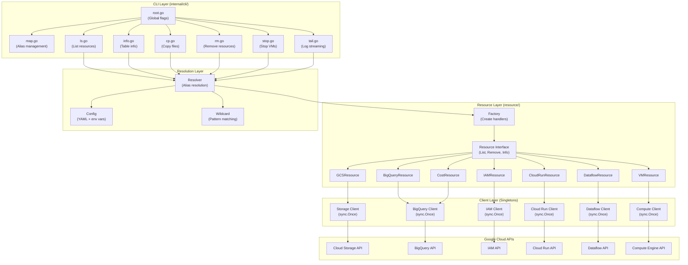
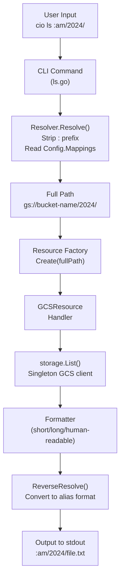
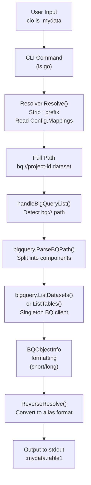

# CLAUDE.md

This file provides guidance to Claude Code (claude.ai/code) when working with code in this repository.

## IMPORTANT: Keep Documentation Updated

After implementing any feature, bug fix, or change, **always update this CLAUDE.md file** to reflect the latest knowledge and features. This file is the primary context source for the LLM — if it's outdated, future sessions will lack critical information. Update relevant sections: key capabilities, CLI commands, usage examples, implemented features, architecture diagrams, and any new patterns or conventions.

## Project Overview

`cio` (Cloud IO) is a fast Go CLI tool for Google Cloud Storage, BigQuery, IAM, Cloud Run, Dataflow, Compute Engine, Cloud SQL, Load Balancers, Certificate Manager, and Billing/Cost data that replaces lengthy `gcloud` and `bq` commands with short, memorable aliases. It maps user-defined aliases to full resource paths, enabling commands like `cio ls :am` instead of `gcloud storage ls gs://io-spooler-onprem-archived-metrics/` or `cio ls vm://` to list VM zones.

**Alias Syntax:**
- Aliases are prefixed with `:` to distinguish them from regular paths
- Created without `:` prefix: `cio map am gs://bucket/` or `cio map mydata bq://project-id.dataset`
- Used with `:` prefix: `cio ls :am/path/` or `cio ls :mydata`

**Key capabilities:**
- Alias-based path resolution for GCS, BigQuery, IAM, Cloud Run, Dataflow, and VM
  - GCS: `:am` → `gs://bucket-name/`
  - BigQuery: `:mydata` → `bq://project-id.dataset`
  - IAM: Direct paths like `iam://project-id/service-accounts`
  - Cloud Run: `svc://`, `jobs://`, `worker://`
  - Cloud SQL: `sql://`
  - Load Balancers: `lb://`
  - Certificate Manager: `certs://`
  - Projects: `projects://`
  - Dataflow: `dataflow://`
  - VM: `vm://zone/instance-name`
  - Cost/Billing: `cost://` (queries BigQuery billing export)
- Familiar Unix-like commands (`ls`, `cp`, `rm`, `stop`, `start`, `tail`, `scale`, `cancel` with various flags)
- Wildcard pattern support (`*.log`, `2024-*.csv`) for GCS, VM, and all resource types
- **Discover mode**: query resources across multiple projects with single-slash syntax (`scheme:/project-pattern/rest`)
- BigQuery listing: datasets, tables, and table schemas
- BigQuery interactive SQL shell with proper horizontal scrolling (peterh/liner)
- IAM listing: service accounts with metadata
- Compute Engine: list zones/instances, stop/delete VMs (parallel), tail logs and serial port
- Cloud Run & Dataflow: list resources, tail/stream logs, manage executions
- Cloud SQL: list/info instances, start/stop/delete, list databases
- Load Balancers: list URL maps, forwarding rules, backend services
- Certificate Manager: list certificates, certificate maps, map entries
- Projects: list accessible GCP projects with filtering
- Cost/Billing: query BigQuery billing export for cost breakdowns by service, project, or day
- YAML configuration with environment variable expansion
- Google Application Default Credentials (ADC) authentication
- JSON output (`--json`) for all list operations
- Singleton client pattern for performance (GCS, BigQuery, IAM, Cloud Run, Dataflow, Compute, Cloud SQL, LB, CertManager)
- Bidirectional file transfer (local ↔ GCS) with parallel chunked downloads
- FUSE filesystem support for GCS, BigQuery, and IAM (experimental)

## Development Commands

### Using Mise (Recommended)
```bash
mise build                  # Build the cio binary
mise test                   # Run all tests
mise test-coverage          # Generate HTML coverage report
mise check                  # Run fmt, vet, and tests
mise fmt                    # Format code
mise vet                    # Run go vet
mise lint                   # Run golangci-lint (if installed)
mise tidy                   # Tidy and verify dependencies
mise clean                  # Remove build artifacts
mise doctor                 # Check development environment
mise auth-setup             # Setup GCP authentication (gcloud auth application-default login)
```

### Running the Tool
```bash
mise run                    # Build and run with arguments (e.g., mise run -- ls am)
mise dev                    # Run with --verbose flag
go run cmd/cio/main.go      # Direct execution
```

### Building
```bash
mise build                  # Local build → ./cio
mise release-build          # Optimized build with stripped symbols
mise install                # Install to $GOPATH/bin
```

### Testing
```bash
mise test                   # Run all tests with verbose output
go test ./...               # Standard test run
go test -v ./internal/resolver  # Test specific package
```

## Architecture

### System Architecture Diagram



### Core Components

**0. Resource Abstraction Layer (`resource/`)**
- **Unified interface** for all resource types (GCS, BigQuery, IAM, Cloud Run, Dataflow, VM)
- `Resource` interface defines common operations:
  - `List()` - list resources at a path
  - `Remove()` - delete resources
  - `Info()` - get detailed information
  - `ParsePath()` - parse resource paths
  - `FormatShort/Long/Detailed()` - format output
- Implementations:
  - `GCSResource` - handles GCS objects and directories
  - `BigQueryResource` - handles BigQuery datasets and tables
  - `IAMResource` - handles IAM service accounts
  - `CloudRunResource` - handles Cloud Run services, jobs, executions, worker pools
  - `DataflowResource` - handles Dataflow jobs
  - `VMResource` - handles Compute Engine VM instances and zones
  - `CostResource` - handles billing cost data via BigQuery export
- `Factory` - creates appropriate resource handler based on path type
- `ResourceInfo` - unified data structure for resource metadata
- Benefits:
  - Single codebase for all resource types
  - Easy to add new resource types (Cloud Storage, Cloud SQL, etc.)
  - Consistent behavior across all commands
  - Simplified CLI command implementations

**1. Alias Resolution Flow (`internal/resolver/`)**
- `Resolver` converts alias paths (with `:` prefix) to full paths using config mappings
- Examples:
  - GCS: `:am/2024/01/` → `gs://io-spooler-onprem-archived-metrics/2024/01/`
  - BigQuery: `:mydata.table1` → `bq://project-id.dataset.table1`
- `ReverseResolve()` converts full paths back to alias format:
  - GCS: `gs://bucket/file` → `:am/file`
  - BigQuery: `bq://project.dataset.table` → `:mydata.table`
- Path parsing:
  - `ParseGCSPath()` splits `gs://bucket/object` into components
  - `ParseBQPath()` splits `bq://project.dataset.table` into components
- Path detection:
  - `IsGCSPath()` checks for `gs://` prefix
  - `IsBQPath()` checks for `bq://` prefix
  - `IsIAMPath()` checks for `iam://` prefix
  - `IsCloudRunPath()` checks for `svc://`, `jobs://`, `worker://` prefixes
  - `IsDataflowPath()` checks for `dataflow://` prefix
  - `IsVMPath()` checks for `vm://` prefix
  - `IsCostPath()` checks for `cost://` prefix
- **Important**: Input must start with `:` for alias paths (e.g., `:am/path` or `:mydata`)

**2. Configuration System (`config/`)**
- YAML-based config with environment variable expansion (`${VAR}` syntax)
- Config resolution order: `--config` flag → `CIO_CONFIG` env → `~/.config/cio/config.yaml` → `~/.cio/config.yaml`
- Default region: `europe-west3` (per global CLAUDE.md)
- `Config.Validate()` ensures aliases don't contain `/` or `.` and paths start with `gs://`
- Auto-creates config directory on first `Save()`
- `BillingConfig` section for cost provider: `billing.table` and `billing.detailed_table`

**3. Storage Client (`internal/storage/`)**
- **Singleton pattern**: `GetClient()` uses `sync.Once` to create GCS client once per process
- Authentication via ADC (Application Default Credentials)
- Operations:
  - `ListBuckets()` - lists all buckets in a GCP project
  - `ListByPath()`, `ListWithPattern()` - list objects in buckets
  - `UploadFile()`, `UploadDirectory()` - upload to GCS
  - `DownloadFile()`, `DownloadDirectory()`, `DownloadWithPattern()` - download from GCS
  - `RemoveObject()`, `RemoveDirectory()`, `RemoveWithPattern()` - delete from GCS
- `Close()` should be called when program exits (handled in `cmd/cio/main.go`)

**3b. BigQuery Client (`internal/bigquery/`)**
- **Singleton pattern**: `GetClient()` uses `sync.Once` to create BigQuery client once per process
- Requires project ID parameter for initialization
- Authentication via ADC (Application Default Credentials)
- Operations:
  - `ListDatasets()` - lists datasets in a project
  - `ListTables()` - lists tables in a dataset
  - `DescribeTable()` - shows table schema and metadata
- `BQObjectInfo` type for formatting BigQuery results
- `Close()` should be called when program exits

**3c. IAM Client (`iam/`)**
- **Singleton pattern**: `GetClient()` uses `sync.Once` to create IAM client once per process
- Authentication via ADC (Application Default Credentials)
- Operations:
  - `ListServiceAccounts()` - lists service accounts in a project
  - `GetServiceAccount()` - gets details about a specific service account
  - `ParseIAMPath()` - parses `iam://project-id/resource-type` paths
- `ServiceAccountInfo` type for formatting service account results
- `Close()` should be called when program exits

**3d. Compute Engine Client (`compute/`)**
- **Singleton pattern**: `GetInstancesClient()` uses `sync.Once` to create Compute client once per process
- Authentication via ADC (Application Default Credentials)
- Operations:
  - `ListInstances()` - lists instances in a zone or across all zones (aggregated)
  - `StopInstance()` - stops a running VM instance
  - `DeleteInstance()` - deletes a VM instance
  - `GetSerialPortOutput()` - fetches serial port output (for log tailing)
- `InstanceInfo` type for formatting VM instance results
- `Close()` should be called when program exits

**4. CLI Commands (`internal/cli/`)**
- **root.go**: Global flags (`--config`, `--project`, `--region`, `--verbose`)
  - `PersistentPreRunE` loads config and overrides with CLI flags
- **map.go**: Manage alias mappings (`map <alias> <path>`, `map list`, `map show`, `map delete`)
  - Aliases created without `:` but used with it
- **ls.go**: List GCS objects, BigQuery datasets/tables, IAM, Cloud Run, Dataflow, VMs, or costs
  - GCS: formatting options (`-l`, `-r`, `--human-readable`, `--max-results`)
  - GCS wildcards: `cio ls ':am/logs/*.log'`
  - BigQuery: lists datasets (`bq://project`) or tables (`bq://project.dataset`)
  - BigQuery wildcards: `cio ls ':mydata.events_*'`
  - BigQuery `-l` shows type, size, and row counts
  - IAM: lists service accounts (`iam://project-id/service-accounts`)
  - IAM `-l` shows email, display name, and disabled status
  - VM: `vm://` lists zones, `vm://zone` lists instances, `vm://*/pattern*` wildcards
  - VM `-l` shows status, machine type, zone, IP, created time
  - Cloud Run jobs: `cio ls -l jobs://` shows status, active/total executions, updated
  - Cloud Run workers: `cio ls -l worker://` shows status, instance count, updated
  - Cost: `cio ls cost://` by service, `cost://projects`, `cost://daily`, `cost://daily/services`
  - `--json` flag outputs all resources as a JSON array
  - `--month YYYY-MM` filter for billing data (default: current month)
  - `--sort=cost|gross|credits` sort for cost output
  - Output uses alias format: `:am/file.txt` or `:mydata.table1`
- **info.go**: Show detailed BigQuery table information
  - Displays table schema with nested RECORD fields
  - Shows description, timestamps, location, size, row count
  - Example: `cio info :mydata.events`
  - Only supports BigQuery tables (not GCS objects)
- **cp.go**: Copy files between local and GCS (`-r` for recursive)
  - Upload: `cio cp file.txt :am/path/`
  - Download: `cio cp :am/file.txt ./local/`
  - Wildcard download: `cio cp ':am/logs/*.log' ./local/`
  - Messages show alias paths: `Uploaded: file.txt → :am/path/file.txt`
- **rm.go**: Remove GCS objects, BigQuery tables/datasets, Cloud Run executions, or VMs
  - GCS wildcards: `cio rm ':am/temp/*.tmp'`
  - BigQuery tables: `cio rm :mydata.events`
  - BigQuery wildcards: `cio rm ':mydata.temp_*'`
  - BigQuery datasets: `cio rm -r :mydata` (removes all tables)
  - VM: `cio rm vm://zone/name` (stops then deletes), wildcards with `vm://*/pattern*`
  - VM operations run in parallel (stop all, then delete all)
  - Lists all matching items BEFORE deletion
  - Confirmation prompts unless `-f` is used
  - Displays alias paths in confirmations and output
  - **CRITICAL**: Only deletes when explicitly requested by user
- **cancel.go**: Cancel running Cloud Run job executions (`cio cancel`)
  - Cancel specific execution: `cio cancel jobs://job-name/execution-name`
  - Cancel all running executions: `cio cancel 'jobs://job-name/*'`
  - Discover mode: `cio cancel 'jobs:/iom-*/sqlmesh*/*'` (across projects)
  - Parallel cancellation with per-execution timing output
  - Force flag (`-f`) to skip confirmation
- **scale.go**: Scale Cloud Run worker pool instances (`cio scale`)
  - Example: `cio scale worker://pool-name 3`
  - Scale to zero: `cio scale worker://pool-name 0`
  - Uses `UpdateWorkerPool` API with `scaling.manual_instance_count`
- **start.go**: Start stopped Cloud SQL instances (`cio start`)
  - Start single or multiple instances: `cio start 'sql://staging-*'`
  - Parallel start with confirmation
- **stop.go**: Stop VM or Cloud SQL instances (`cio stop`)
  - VM: `cio stop 'vm://*/bastion-*'`
  - Cloud SQL: `cio stop sql://my-instance`
  - Stops running instances in parallel, skips already-stopped ones
  - Discover mode: `cio stop 'vm:/iom-*/*/bast*'`
  - Force flag (`-f`) to skip confirmation
- **tail.go**: Show/stream logs for Cloud Run, Dataflow, and VM
  - Cloud Run: `cio tail svc://service`, `cio tail -f jobs://job-name`
  - Dataflow: `cio tail dataflow://job-id`, `--log-type` filter
  - VM Cloud Logging: `cio tail vm://zone/instance`, wildcards `vm://*/pattern*`
  - VM serial port: `cio tail -f vm://zone/instance/serial`
  - Multi-VM tailing: colored `[instance-name]` prefixes per instance
  - `-f` for follow/stream mode, `-n N` for line count, `-s` for severity filter
- **shell.go**: Interactive BigQuery SQL shell (`cio query`)
  - Uses `peterh/liner` for proper horizontal scrolling on long lines
  - Features:
    - Multi-line SQL input (continue until `;` is entered)
    - Command history (saved to `~/.config/cio/query_history`)
    - Tab completion for SQL keywords
    - Alias resolution in SQL queries (`:mydata.table`)
    - Meta-commands: `\d <table>` (describe), `\l` (list tables hint), `\q` (quit)
    - Keyboard shortcuts: Ctrl+A (start), Ctrl+E (end), Ctrl+C (cancel), Ctrl+D (exit)
  - **Important**: Migrated from `chzyer/readline` to `peterh/liner` to fix horizontal scrolling issues
  - History file: `~/.config/cio/query_history`
  - Example: `cio query` → starts interactive SQL shell

**5. Wildcard Support (`internal/resolver/wildcard.go`)**
- `HasWildcard()` detects `*` and `?` in paths
- `MatchPattern()` implements glob-style pattern matching
- `SplitWildcardPath()` separates base path from pattern
- Pattern matching supports:
  - `*` - matches any sequence of characters
  - `?` - matches any single character

### Data Flow

**GCS Operations:**



**BigQuery Operations:**



## Important Patterns

### CRITICAL SAFETY RULE - Data Deletion

**UNDER NO CIRCUMSTANCES should anything be deleted from GCS, BigQuery, or Compute Engine unless EXPLICITLY requested by the user.**

This rule applies to:
- GCS objects and directories (`storage.RemoveObject`, `storage.RemoveDirectory`, `storage.RemoveWithPattern`)
- BigQuery tables and datasets (`bigquery.RemoveTable`, `bigquery.RemoveDataset`, `bigquery.RemoveTablesWithPattern`)
- VM instances (`compute.StopInstance`, `compute.DeleteInstance`)
- ANY operation that uses the `rm`, `stop`, or deletion functions

**Rules:**
1. NEVER proactively suggest or execute deletions
2. NEVER delete data as part of "cleanup" or "optimization"
3. ONLY execute `rm` operations when the user explicitly runs `cio rm <path>`
4. ALWAYS show what will be deleted and ask for confirmation (unless `-f` flag is used)
5. List all matching objects/tables BEFORE deletion confirmation
6. When in doubt, DO NOT DELETE - ask the user first

**Example - WRONG:**
```
User: "The temp tables are cluttering the dataset"
Assistant: "Let me clean those up for you" [executes rm command] ❌ NEVER DO THIS
```

**Example - CORRECT:**
```
User: "The temp tables are cluttering the dataset"
Assistant: "You can remove them with: cio rm ':mydata.temp_*'" ✅
[User must explicitly run the command themselves]
```

### Adding New Commands

**Option 1: Using Resource Abstraction (Recommended)**
1. Create command file in `internal/cli/` (e.g., `mycommand.go`)
2. Create Resolver: `resolver := resolver.New(cfg)`
3. Resolve path: `fullPath, err := resolver.Resolve(userPath)`
4. Create factory: `factory := resource.NewFactory(resolver.ReverseResolve)`
5. Get resource handler: `res, err := factory.Create(fullPath)`
6. Call resource methods: `res.List()`, `res.Remove()`, `res.Info()`, etc.
7. Format output: `res.FormatShort()`, `res.FormatLong()`, etc.
8. Register command in `init()` function: `rootCmd.AddCommand(myCmd)`

Example:
```go
// List resources using abstraction
factory := resource.NewFactory(r.ReverseResolve)
res, err := factory.Create(fullPath)
resources, err := res.List(ctx, fullPath, &resource.ListOptions{})
for _, info := range resources {
    aliasPath := r.ReverseResolve(info.Path)
    fmt.Println(res.FormatShort(info, aliasPath))
}
```

**Option 2: Direct Implementation (Legacy)**
1. Create command file in `internal/cli/` (e.g., `cp.go`)
2. Use `GetConfig()` to access global config instance
3. Create Resolver: `resolver := resolver.New(cfg)`
4. Use `resolver.Resolve(aliasPath)` to convert alias to full path
5. Check path type and call appropriate package (storage or bigquery)
6. Register command in `init()` function: `rootCmd.AddCommand(cpCmd)`

### Path Handling
- Always use `resolver.Resolve()` to handle both alias paths and full GCS paths
- Use `resolver.NormalizePath()` to ensure paths end with `/` when needed
- Use `resolver.ParseGCSPath()` to split GCS paths into bucket and object
- Check for wildcards with `resolver.HasWildcard()` before processing paths
- Use `resolver.MatchPattern()` for pattern matching operations
- Validate user input with `resolver/validator.go` functions

### Wildcard Operations
- Check paths for wildcards using `resolver.HasWildcard(path)`
- For listing: use `storage.ListWithPattern()` instead of `storage.List()`
- For removal: use `storage.RemoveWithPattern()` instead of `storage.RemoveObject()`
- For download: use `storage.DownloadWithPattern()` instead of `storage.DownloadFile()`
- Always quote wildcard patterns in shell: `':am/logs/*.log'` not `:am/logs/*.log`
- Wildcard matching happens on the object name after alias resolution

### Alias Path Formatting
- All storage functions accept a `PathFormatter` parameter for output
- Use `resolver.ReverseResolve` as the formatter to convert GCS paths to alias format
- Output will show `:am/file.txt` instead of `gs://bucket-name/file.txt`
- This provides consistent user experience - input and output use same format

### Configuration Changes
- Always call `cfg.Save()` after modifying mappings
- Handle missing config gracefully (returns default config)
- Expand env vars with `os.ExpandEnv()` during config load

### Parallel Chunked Downloads
- Files ≥10MB use parallel chunked download automatically (configurable via `download.parallel_threshold`)
- Files <10MB use simple single-threaded download (no overhead)
- Number of parallel chunks controlled by:
  - `download.max_chunks` in config (default: 8, range: 1-32)
  - `-j` flag limits max chunks (e.g., `-j 4` uses max 4 chunks)
  - `-j 1` forces serial download (single chunk, useful for slow connections)
- Each chunk downloaded in parallel using `storage.NewRangeReader()`
- Chunk size automatically calculated: `fileSize / numChunks`
- Progress updates every 2 seconds in verbose mode
- Transfer rate and timing shown in verbose mode:
  ```
  Downloaded: file.zip → /tmp/file.zip (136 MB, 8 chunks in 4.19s, 32.51 MB/s)
  ```

**Why 8 chunks default?**
- Good balance between speed and resource usage
- Each chunk typically 8-20MB for files >100MB
- Too many chunks (e.g., 32) can overwhelm connection and be slower
- Too few chunks (e.g., 2) don't fully utilize parallel capabilities
- Testing shows 4-8 chunks optimal for most network conditions

**Examples:**
```bash
# Default: uses 8 parallel chunks for large files
cio cp --verbose gs://bucket/large.zip /tmp/

# Limit to 4 chunks (good for slower connections)
cio cp -j 4 --verbose gs://bucket/large.zip /tmp/

# Force serial download (1 chunk, useful for unstable connections)
cio cp -j 1 --verbose gs://bucket/large.zip /tmp/
```

### Error Messages
- For missing aliases, suggest: `run 'cio map list' to see available mappings`
- For auth issues, suggest: `run 'mise auth-setup' or 'gcloud auth application-default login'`

## Testing Notes

- Use `context.Background()` for test contexts
- Mock GCS client for unit tests of storage operations
- Test resolver logic without actual GCS calls
- Validate config parsing with malformed YAML examples

## Implemented Features

### Phase 1-3: Completed
- CLI foundation with Cobra
- Configuration management (YAML with env var expansion)
- Alias mapping system (`map` command)
- `ls` command with formatting options (`-l`, `-r`, `--human-readable`)
- Wildcard pattern matching (`*`, `?`) for GCS operations
- Bucket listing: `cio ls-new 'gs://project-id:'` lists all buckets

### Phase 4: BigQuery Support - Completed
- ✅ BigQuery client with singleton pattern
- ✅ BigQuery path format (`bq://project.dataset.table`)
- ✅ Alias support for BigQuery paths (`:mydata.table1`)
- ✅ List datasets: `cio ls bq://project-id`
- ✅ List tables: `cio ls bq://project-id.dataset`
- ✅ List tables with wildcards: `cio ls ':mydata.events_*'`
- ✅ Table metadata: `cio ls -l :mydata.events` (shows size and row counts)
- ✅ Detailed schema: `cio info :mydata.events` (shows full schema with nested fields)
- ✅ Reverse resolve for BigQuery (output shows aliases)
- ✅ Remove tables: `cio rm :mydata.events`
- ✅ Remove with wildcards: `cio rm ':mydata.temp_*'`
- ✅ Remove datasets: `cio rm -r :mydata`

### Phase 5: Copy and Remove - Completed
- ✅ `cp` command (local ↔ GCS, recursive, wildcards)
- ✅ Parallel chunked downloads for large files (≥10MB)
- ✅ Configurable chunk size and parallelism
- ✅ Progress tracking and transfer rate reporting
- ✅ `-j` flag to control parallelism
- ✅ `rm` command for GCS (recursive, force, wildcards)
- ✅ `rm` command for BigQuery (tables, datasets, wildcards)
- ✅ Confirmation prompts with preview of items to be deleted
- ✅ Force flag (`-f`) to skip confirmations

### Phase 6: Compute Engine (VM) Support - Completed
- ✅ Compute Engine client with singleton pattern (`compute/`)
- ✅ VM path format (`vm://zone/instance-name`)
- ✅ List zones: `cio ls vm://` (with instance counts)
- ✅ List instances: `cio ls vm://zone`, `cio ls -l vm://zone`
- ✅ Wildcard support: `cio ls 'vm://*/iomp*'`, `cio ls 'vm://zone/web-*'`
- ✅ All-zones listing: `cio ls vm://*/`
- ✅ Stop instances: `cio stop 'vm://*/pattern*'` (parallel, with confirmation)
- ✅ Delete instances: `cio rm vm://zone/name` (stop + delete, parallel)
- ✅ Cloud Logging tail: `cio tail vm://zone/instance`, multi-VM with wildcards
- ✅ Serial port tail: `cio tail -f vm://zone/instance/serial`
- ✅ Parallel operations for stop/delete with verbose progress output

### Cost/Billing Support - Completed
- ✅ Cost resource type (`cost://`) querying BigQuery billing export
- ✅ Config: `billing.table` and `billing.detailed_table` in YAML
- ✅ Views: by service (default), by project, daily, daily by service, daily for specific service
- ✅ Project filtering with wildcards: `cost://iom-*/daily`
- ✅ Single-slash syntax rewritten to cost:// (no discover mode needed — SQL handles project filtering)
- ✅ `--month YYYY-MM` flag for historical data
- ✅ `--sort=cost|gross|credits` for cost-specific sorting
- ✅ Dynamic column widths for aligned output
- ✅ Total row printed after results
- ✅ `-l` shows gross, credits, and net cost breakdown
- ✅ `--json` output support

### Cancel Discover Mode - Completed
- ✅ `cio cancel 'jobs:/project-pattern/job-pattern/*'` across projects
- ✅ Wildcard job name matching (lists jobs, filters by pattern)
- ✅ Per-project execution cancellation

### JSON Output - Completed
- ✅ `--json` flag on `cio ls` for all resource types
- ✅ ResourceInfo struct has JSON tags
- ✅ Works with discover mode (collects all results, outputs single array)

## Usage Examples

### GCS Examples
```bash
# List all buckets in a project
cio ls-new 'gs://my-project-id:'
cio ls-new -l 'gs://my-project-id:'  # With details

# Create alias for GCS bucket
cio map am gs://io-spooler-onprem-archived-metrics/

# List using alias
cio ls :am

# List with details
cio ls -l :am/2024/

# Copy local to GCS
cio cp file.txt :am/2024/01/

# Copy from GCS to local
cio cp :am/2024/01/data.txt ./

# Remove with wildcards (shows preview and asks for confirmation)
cio rm ':am/temp/*.tmp'

# Force remove without confirmation
cio rm -f ':am/old-data/*'
```

### BigQuery Examples
```bash
# Create alias for BigQuery dataset
cio map mydata bq://my-project-id.my-dataset

# List all datasets in a project
cio ls bq://my-project-id

# List tables in a dataset using full path
cio ls bq://my-project-id.my-dataset

# List tables using alias
cio ls :mydata

# List tables with wildcards
cio ls ':mydata.events_*'

# Show table metadata (one line with size and rows)
cio ls -l :mydata.table1

# Show detailed schema information
cio info :mydata.table1

# Remove single table (asks for confirmation)
cio rm :mydata.temp_table

# Remove tables with wildcard (shows preview, asks for confirmation)
cio rm ':mydata.staging_*'

# Remove entire dataset with all tables (requires -r flag)
cio rm -r :mydata

# Force remove without confirmation
cio rm -f :mydata.old_table
```

### IAM Examples
```bash
# List service accounts (short format - email only)
cio ls iam://my-project-id/service-accounts

# List with details (email, display name, disabled status)
cio ls -l iam://my-project-id/service-accounts

# FUSE filesystem - mount and browse service accounts
cio mount ~/gcs
ls ~/gcs/iam/service-accounts/
cat ~/gcs/iam/service-accounts/my-sa@project.iam.gserviceaccount.com/metadata.json
```

### VM (Compute Engine) Examples
```bash
# List zones with instance counts
cio ls vm://

# List instances in a zone
cio ls vm://europe-west3-a

# List instances with details (status, machine type, IP)
cio ls -l vm://europe-west3-a

# List all instances across all zones
cio ls 'vm://*/'

# List instances matching a pattern across all zones
cio ls 'vm://*/iomp*'

# Stop instances matching a pattern (parallel, with confirmation)
cio stop 'vm://*/bastion-ephemeral*'

# Force stop without confirmation
cio stop -f 'vm://europe-west3-a/staging-*'

# Stop and delete instances (parallel)
cio rm 'vm://*/staging-*'

# Force delete without confirmation
cio rm -f vm://europe-west3-a/my-instance

# Show VM Cloud Logging output
cio tail vm://europe-west3-a/my-instance

# Stream logs from multiple VMs matching a pattern
cio tail -f 'vm://*/*-ingress*'

# Stream serial port output
cio tail -f vm://europe-west3-a/my-instance/serial
```

### Cloud Run Examples
```bash
# List services with details
cio ls -l svc://

# List jobs with active/total execution counts
cio ls -l jobs://

# List worker pools with instance counts
cio ls -l worker://

# Cancel all running executions for a job
cio cancel 'jobs://my-job/*'

# Cancel a specific execution
cio cancel jobs://my-job/my-job-execution-abc123

# Force cancel without confirmation
cio cancel -f 'jobs://my-job/*'

# Cancel across projects (discover mode)
cio cancel 'jobs:/iom-*/sqlmesh*/*'
cio cancel -f 'jobs:/iom-dev-thies/sqlmesh*/*'

# Scale a worker pool
cio scale worker://iomp-processor 3

# Scale to zero
cio scale worker://iomp-processor 0

# Tail Cloud Run service logs
cio tail svc://my-service
cio tail -f svc://my-service

# Tail Cloud Run job logs
cio tail -f jobs://my-job
```

### Cloud SQL Examples
```bash
# List all instances
cio ls -l sql://

# List with wildcard
cio ls -l 'sql://staging-*'

# Detailed instance info
cio info sql://my-instance

# List databases
cio ls sql://my-instance/databases

# Stop/start instances
cio stop sql://my-instance
cio start sql://my-instance

# Delete instance
cio rm sql://my-instance
```

### Load Balancer Examples
```bash
# List URL maps (load balancers)
cio ls -l lb://

# List forwarding rules (frontend IPs)
cio ls -l lb://forwarding-rules

# List backend services
cio ls -l lb://backends

# Wildcard
cio ls 'lb://backends/staging-*'
```

### Certificate Manager Examples
```bash
# List certificates
cio ls -l certs://

# List certificate maps
cio ls -l certs://maps

# List entries in a certificate map
cio ls -l certs://maps/my-cert-map/entries

# Wildcard
cio ls 'certs://prod-*'
```

### Projects Examples
```bash
# List all accessible projects
cio ls projects://

# List with details
cio ls -l projects://

# Filter by pattern
cio ls -l 'projects://iom-*'
```

### Cost/Billing Examples
```bash
# Cost by service for current month (net cost)
cio ls cost://

# Cost by service with gross/credits/net breakdown
cio ls -l cost://

# Cost for a specific project
cio ls cost://my-project-id

# Cost for projects matching a wildcard
cio ls -l cost://iom-pro*

# Cost by project (all projects in billing account)
cio ls cost://projects

# Cost by project for matching projects
cio ls -l cost://iom-*/projects

# Daily cost trend
cio ls cost://daily
cio ls cost://my-project/daily

# Daily breakdown by service (with project prefix)
cio ls -l cost:/iom-pro*/daily/services

# Daily for a specific service
cio ls cost://daily/BigQuery
cio ls cost://iom-pro*/daily/Cloud Run

# Specific month
cio ls cost:// --month 2026-02
cio ls -l cost://iom-*/projects --month 2026-01

# Sort by cost (descending)
cio ls -l --sort=cost cost:/iom-pro*/daily/services
cio ls -l --sort=gross cost://
cio ls -l --sort=credits cost://

# JSON output
cio ls --json cost://
cio ls --json cost://iom-pro*/daily
```

**Config requirement** — add to `~/.config/cio/config.yaml`:
```yaml
billing:
  table: project-id.dataset.gcp_billing_export_v1_XXXXXX_YYYYYY_ZZZZZZ
  detailed_table: project-id.dataset.gcp_billing_export_resource_v1_XXXXXX_YYYYYY_ZZZZZZ  # optional
```

**Notes:**
- Data comes from BigQuery billing export (must be enabled in GCP Console)
- Data latency: hours to ~24h (not real-time)
- The table name includes your billing account ID (hyphens → underscores)
- Queries always filter by `invoice.month` to avoid full table scans
- Net cost = gross cost + credits (credits are negative)
- Single-slash syntax (`cost:/project-pattern/...`) works but doesn't use discover mode — project filtering happens in the SQL WHERE clause

### Discover Mode (Multi-Project)
```bash
# Single slash = discover mode (query across matching projects)
# Double slash = current project only

# List services across all iom-* projects
cio ls -l 'svc:/iom-*/'

# List Cloud SQL instances across projects
cio ls -l 'sql:/iom-*/'

# List VMs matching a pattern across projects
cio ls -l 'vm:/iom-*/*/bast*'

# List load balancers across projects
cio ls -l 'lb:/iom-*/'

# Delete VMs across projects (with confirmation)
cio rm 'vm:/iom-*/*/staging-*'

# Stop VMs across projects
cio stop 'vm:/iom-*/*/bast*'

# Cancel Cloud Run job executions across projects
cio cancel 'jobs:/iom-*/sqlmesh*/*'
```

## Future Features (Phase 7+)
- Web server for file browsing (config: `server.port`, `server.host`, `server.auto_start`)
- Additional commands: `mv`, `cat`, `du`
- GCS to GCS copy operations
