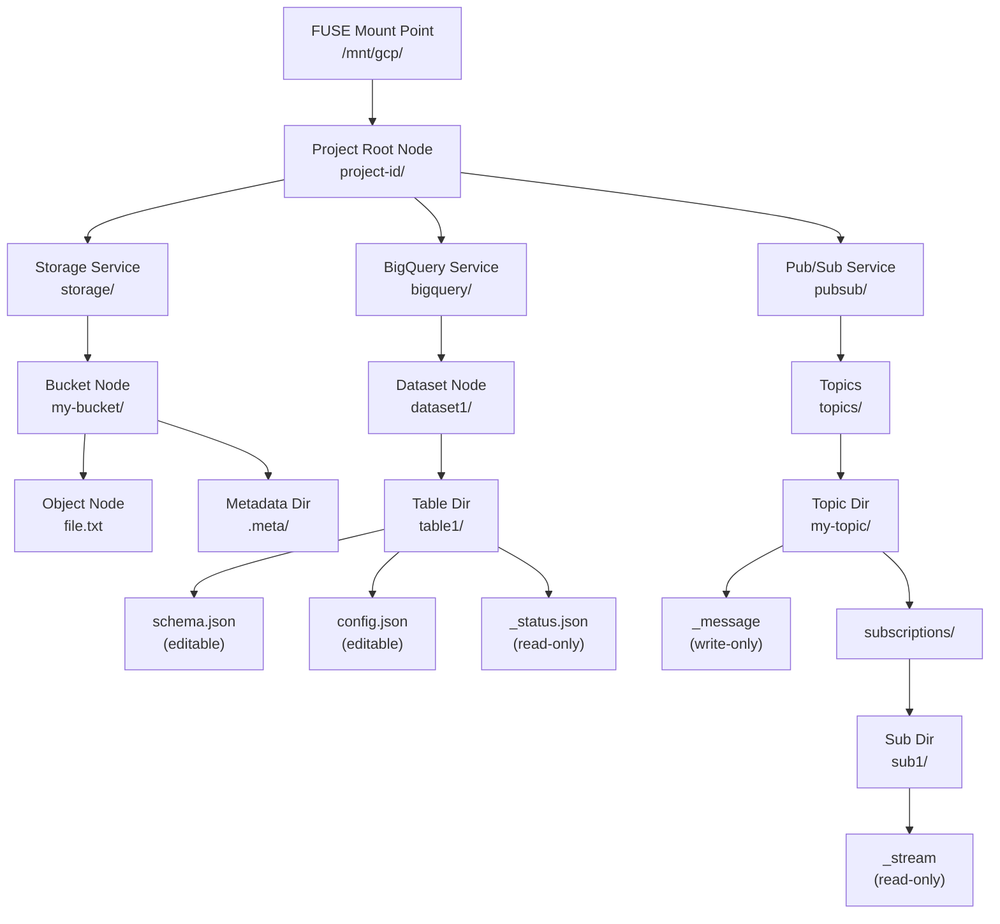
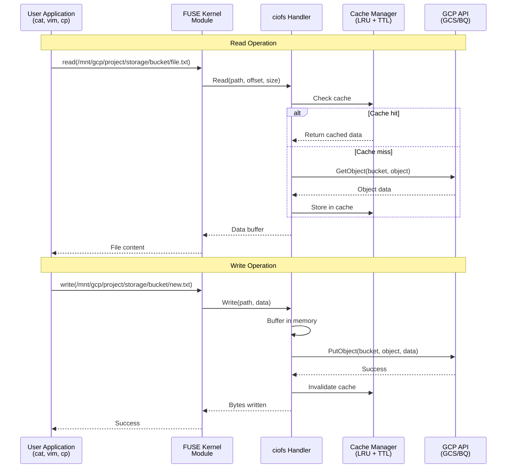
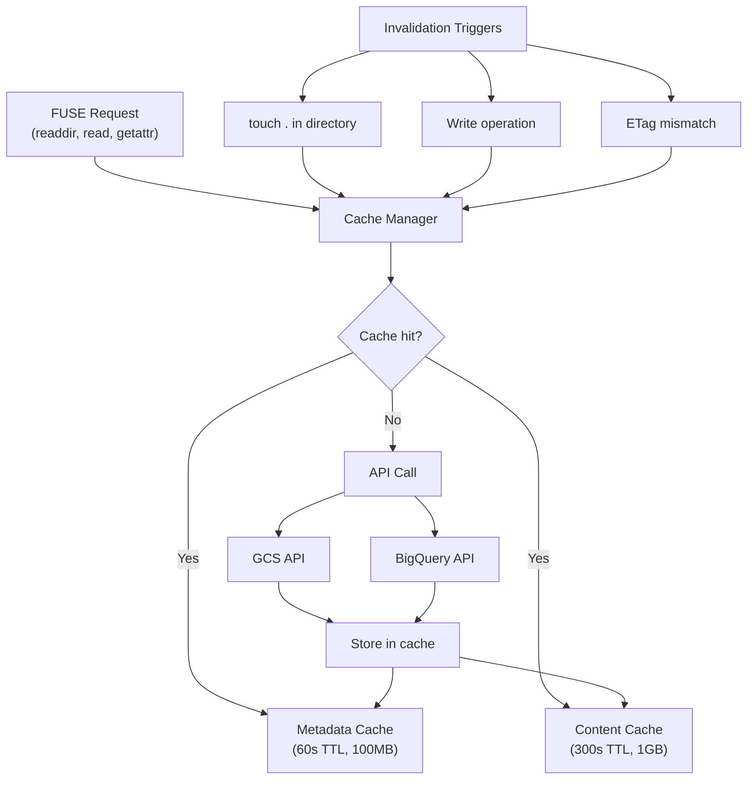
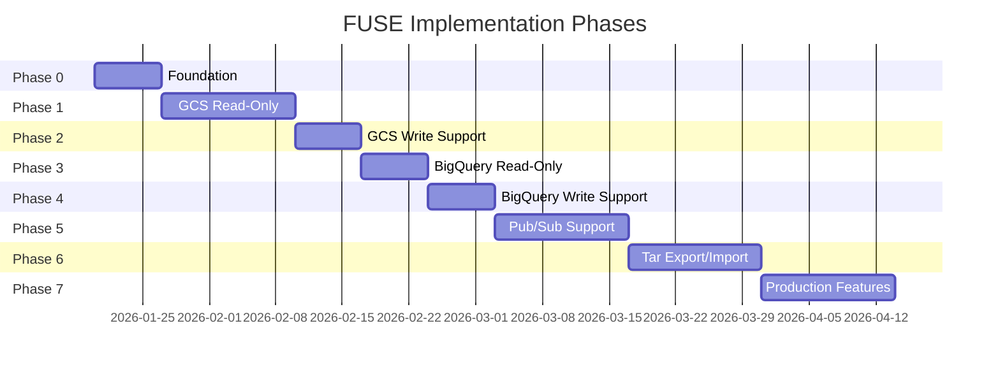
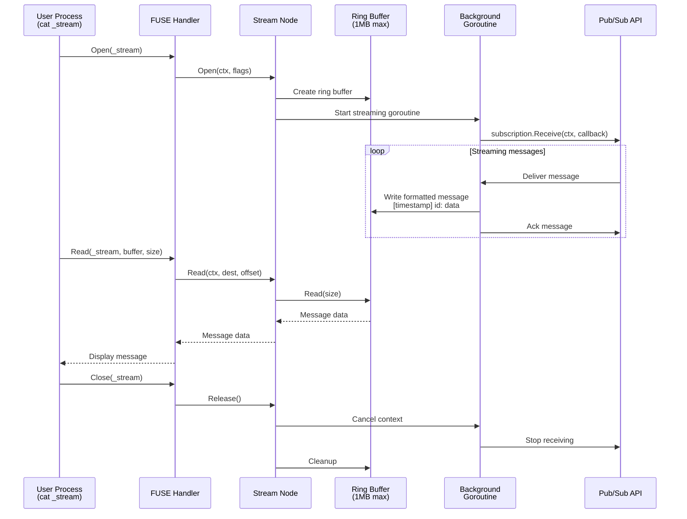

# FUSE Filesystem for GCP Resources - Implementation Plan

## Executive Summary

This plan outlines building a FUSE filesystem (`ciofs`) that mounts GCP resources as a native filesystem, enabling infrastructure management through standard filesystem operations. The key innovation: `tar` can export entire project configurations, and `untar` can recreate infrastructure declaratively.

## 1. Technology Stack Recommendations

### FUSE Library: **hanwen/go-fuse v2**

**Justification:**
- **Performance**: [3x faster than jacobsa/fuse](https://github.com/Hughen/fuse-benchmark) (5.7 GB/s vs 1.9 GB/s)
- **Protocol Support**: Latest FUSE protocol 7.28 vs jacobsa's 7.12
- **Maintenance**: Actively maintained; bazil/fuse appears abandoned
- **Integration**: Used by production tools like [rclone](https://github.com/rclone/rclone/issues/5896)
- **API**: The `fs` package provides a [high-performance API that minimizes pitfalls](https://pkg.go.dev/github.com/hanwen/go-fuse/v2/fs)

**Trade-offs:**
- Documentation less friendly than jacobsa/fuse
- More complex API than bazil/fuse
- Acceptable: performance and maintenance outweigh learning curve

### Core Dependencies

```go
github.com/hanwen/go-fuse/v2 v2.x  // FUSE implementation
cloud.google.com/go/storage        // Already in use
cloud.google.com/go/bigquery       // Already in use
cloud.google.com/go/pubsub         // New: Pub/Sub support
```

### Existing Infrastructure to Leverage

The `cio` codebase provides excellent foundations:
- **Resource abstraction layer** (`internal/resource/`) - unified interface for GCS, BigQuery
- **Singleton client pattern** - efficient connection pooling
- **Path resolution** - alias system can map to mount points
- **BigQuery metadata handling** - schema formatting, pagination

## 2. Filesystem Hierarchy Design

### Architecture Overview



### Mount Point Structure

```
/mnt/gcp/
├── project-id/                    # Root = GCP Project
│   ├── storage/                   # Cloud Storage
│   │   ├── bucket-name/
│   │   │   ├── object.txt         # Object content
│   │   │   ├── .meta/             # Metadata directory
│   │   │   │   ├── object.txt.json    # Object metadata
│   │   │   │   └── _bucket.json       # Bucket metadata
│   │   │   └── prefix/
│   │   │       └── nested.txt
│   │   └── another-bucket/
│   │
│   ├── bigquery/                  # BigQuery
│   │   ├── dataset1/
│   │   │   ├── table1/
│   │   │   │   ├── schema.json    # User-editable schema
│   │   │   │   ├── config.json    # User-editable: description, labels, expiration
│   │   │   │   └── _status.json   # Server-generated: created, modified, size, rows
│   │   │   ├── table2/
│   │   │   └── .meta/
│   │   │       └── _dataset.json  # Dataset metadata
│   │   └── dataset2/
│   │
│   └── pubsub/                    # Pub/Sub
│       ├── topics/
│       │   ├── my-topic/
│       │   │   ├── _message       # Write-only: publish messages (echo "msg" > _message)
│       │   │   ├── config.json    # Topic config
│       │   │   └── subscriptions/
│       │   │       ├── sub1/
│       │   │       │   ├── _stream    # Read-only: streaming pull (cat _stream)
│       │   │       │   └── config.json
│       │   │       └── sub2/
│       │   └── other-topic/
│       └── .meta/
│           └── _quotas.json       # Project quotas
```

### File Type Semantics

| Path Pattern | Type | Read | Write | Notes |
|-------------|------|------|-------|-------|
| `storage/bucket/object.txt` | Regular file | Object content | Upload | Actual data |
| `.meta/*.json` | Regular file | Metadata JSON | No-op | Read-only metadata |
| `bigquery/dataset/table/schema.json` | Regular file | Schema | Update table | User-editable |
| `bigquery/dataset/table/config.json` | Regular file | Config | Update table | User-editable |
| `bigquery/dataset/table/_status.json` | Regular file | Status | No-op | Server-generated |
| `pubsub/topics/my-topic/_message` | Special file | Error | Publish | Write-only |
| `pubsub/.../sub/_stream` | Special file | Stream msgs | Error | Read-only stream |

### Design Rationale

1. **Separation of concerns**: Metadata in `.meta/` directories keeps object namespaces clean
2. **Editability distinction**: Files starting with `_` are server-generated (read-only), others are user-editable
3. **Natural hierarchy**: Mirrors GCP console structure for discoverability
4. **Tar-friendly**: All configuration is in regular files, making `tar` trivial

## 3. Metadata File Format Specifications

### 3.1 GCS Metadata (`storage/bucket/.meta/object.txt.json`)

```json
{
  "version": "1",
  "type": "gcs-object-metadata",
  "bucket": "bucket-name",
  "name": "object.txt",
  "content_type": "text/plain",
  "size": 1024,
  "md5_hash": "5d41402abc4b2a76b9719d911017c592",
  "crc32c": "yZRlqg==",
  "created": "2026-01-17T12:00:00Z",
  "updated": "2026-01-17T12:30:00Z",
  "generation": "1705492800000000",
  "metageneration": "1",
  "storage_class": "STANDARD",
  "custom_metadata": {
    "user-key": "user-value"
  }
}
```

### 3.2 BigQuery Schema (`bigquery/dataset/table/schema.json`)

User-editable. Writing to this file updates the table schema.

```json
{
  "version": "1",
  "type": "bigquery-schema",
  "fields": [
    {
      "name": "id",
      "type": "INTEGER",
      "mode": "REQUIRED",
      "description": "Unique identifier"
    },
    {
      "name": "data",
      "type": "RECORD",
      "mode": "NULLABLE",
      "fields": [
        {
          "name": "value",
          "type": "STRING",
          "mode": "NULLABLE"
        }
      ]
    }
  ]
}
```

### 3.3 BigQuery Config (`bigquery/dataset/table/config.json`)

User-editable. Writing updates table configuration.

```json
{
  "version": "1",
  "type": "bigquery-table-config",
  "description": "User-facing description",
  "expiration_time": "2027-01-17T00:00:00Z",
  "labels": {
    "env": "production",
    "team": "data"
  },
  "require_partition_filter": false,
  "encryption": null
}
```

### 3.4 BigQuery Status (`bigquery/dataset/table/_status.json`)

Read-only, server-generated.

```json
{
  "version": "1",
  "type": "bigquery-table-status",
  "num_bytes": 1073741824,
  "num_rows": 1000000,
  "created": "2026-01-17T12:00:00Z",
  "modified": "2026-01-17T14:30:00Z",
  "location": "europe-west3",
  "type": "TABLE",
  "etag": "abc123"
}
```

### 3.5 Pub/Sub Topic Config (`pubsub/topics/my-topic/config.json`)

```json
{
  "version": "1",
  "type": "pubsub-topic-config",
  "labels": {
    "env": "production"
  },
  "message_retention_duration": "86400s",
  "schema_settings": null
}
```

### 3.6 Pub/Sub Subscription Config (`pubsub/topics/my-topic/subscriptions/sub1/config.json`)

```json
{
  "version": "1",
  "type": "pubsub-subscription-config",
  "ack_deadline_seconds": 10,
  "retain_acked_messages": false,
  "message_retention_duration": "604800s",
  "filter": "",
  "dead_letter_policy": null,
  "retry_policy": null
}
```

### Read/Write Data Flow



### Caching Architecture



### Implementation Timeline



## 4. Implementation Phases

### Phase 0: Foundation (Week 1)

**Goal**: Basic FUSE infrastructure

**Deliverables**:
- Mount/unmount capability
- Static directory structure (hardcoded project ID)
- Read-only directory listing for `storage/`, `bigquery/`, `pubsub/`
- Basic logging and error handling

**Implementation**:
```go
// internal/fuse/mount.go
package fuse

import (
    "context"
    "github.com/hanwen/go-fuse/v2/fs"
    "github.com/hanwen/go-fuse/v2/fuse"
)

func Mount(mountpoint string, projectID string) (*fuse.Server, error) {
    root := &RootNode{projectID: projectID}
    server, err := fs.Mount(mountpoint, root, &fs.Options{
        MountOptions: fuse.MountOptions{
            Debug: true,  // Enable for development
            FsName: "ciofs",
            Name: "ciofs",
        },
    })
    return server, err
}
```

**Testing**: `ls /mnt/gcp/my-project/` shows `storage/`, `bigquery/`, `pubsub/`

### Phase 1: GCS Read-Only (Week 2-3)

**Goal**: Browse GCS buckets and read objects

**Deliverables**:
- List buckets under `storage/`
- List objects in buckets
- Read object content via `cat`
- Read-only metadata in `.meta/` directories
- Cache with TTL (60s default)

**Architecture**:
```go
// internal/fuse/gcs_node.go
type GCSBucketNode struct {
    fs.Inode
    bucket string
    cache *CacheManager
}

func (n *GCSBucketNode) Readdir(ctx context.Context) (fs.DirStream, syscall.Errno) {
    // Use existing storage.ListByPath from cio
    // Return entries + .meta directory
}

type GCSObjectNode struct {
    fs.Inode
    bucket string
    object string
}

func (n *GCSObjectNode) Read(ctx context.Context, dest []byte, off int64) (fuse.ReadResult, syscall.Errno) {
    // Use storage.GetClient and object.NewReader()
    // Implement range reads for large files
}
```

**Caching Strategy**:
- Metadata cache: 60s TTL (configurable)
- Invalidate on `touch .` in directory
- LRU eviction when cache exceeds 100MB
- Following [Cloud Storage FUSE patterns](https://cloud.google.com/storage/docs/cloud-storage-fuse/file-caching)

**Testing**:
```bash
ls /mnt/gcp/my-project/storage/my-bucket/
cat /mnt/gcp/my-project/storage/my-bucket/file.txt
cat /mnt/gcp/my-project/storage/my-bucket/.meta/file.txt.json
```

### Phase 2: GCS Write Support (Week 4)

**Goal**: Upload and delete GCS objects

**Deliverables**:
- Write to files (upload objects)
- Delete files (`rm`)
- Create/delete directories (object prefixes)
- Metadata updates via `.meta/*.json` files (no-op for now)

**Implementation**:
```go
func (n *GCSObjectNode) Write(ctx context.Context, data []byte, off int64) (uint32, syscall.Errno) {
    // Buffer writes in memory or temp file
    // Flush on Close() using storage.UploadFile pattern
}

func (n *GCSBucketNode) Unlink(ctx context.Context, name string) syscall.Errno {
    // Delete object using storage.RemoveObject pattern
}
```

**Challenges**:
- Streaming writes: [gcsfuse uses direct streaming](https://cloud.google.com/storage/docs/gcsfuse-performance-and-best-practices) to avoid temp files
- Large file handling: buffer in temp file if > 10MB
- Concurrent writes: fail with EBUSY

**Testing**:
```bash
echo "hello" > /mnt/gcp/my-project/storage/my-bucket/test.txt
rm /mnt/gcp/my-project/storage/my-bucket/test.txt
mkdir /mnt/gcp/my-project/storage/my-bucket/new-dir/
```

### Phase 3: BigQuery Read-Only (Week 5)

**Goal**: Browse datasets and read table metadata

**Deliverables**:
- List datasets under `bigquery/`
- List tables in datasets
- Read `schema.json`, `config.json`, `_status.json`
- Leverage existing `bigquery.ListDatasets`, `bigquery.DescribeTable`

**Implementation**:
```go
type BigQueryTableNode struct {
    fs.Inode
    projectID string
    datasetID string
    tableID   string
}

func (n *BigQueryTableNode) Readdir(ctx context.Context) (fs.DirStream, syscall.Errno) {
    // Return: schema.json, config.json, _status.json
    return &staticDirStream{
        entries: []fuse.DirEntry{
            {Name: "schema.json", Mode: fuse.S_IFREG},
            {Name: "config.json", Mode: fuse.S_IFREG},
            {Name: "_status.json", Mode: fuse.S_IFREG},
        },
    }, 0
}
```

**Schema Generation**:
```go
func generateSchemaJSON(table *bigquery.TableMetadata) ([]byte, error) {
    schema := SchemaFile{
        Version: "1",
        Type: "bigquery-schema",
        Fields: convertBQSchemaToJSON(table.Schema),
    }
    return json.MarshalIndent(schema, "", "  ")
}
```

**Testing**:
```bash
ls /mnt/gcp/my-project/bigquery/my-dataset/
cat /mnt/gcp/my-project/bigquery/my-dataset/my-table/schema.json
cat /mnt/gcp/my-project/bigquery/my-dataset/my-table/_status.json
```

### Phase 4: BigQuery Write Support (Week 6)

**Goal**: Update table schemas and configuration

**Deliverables**:
- Edit `schema.json` to update table schema
- Edit `config.json` to update description, labels, expiration
- Create new tables via `mkdir table/` + write `schema.json`
- Delete tables via `rmdir`

**Implementation**:
```go
func (n *BigQuerySchemaFileNode) Write(ctx context.Context, data []byte, off int64) (uint32, syscall.Errno) {
    // Parse schema JSON
    var schemaFile SchemaFile
    if err := json.Unmarshal(data, &schemaFile); err != nil {
        return 0, syscall.EINVAL
    }

    // Validate schema
    bqSchema := convertJSONSchemaToBQ(schemaFile.Fields)

    // Update table using bigquery client
    // table.Update(ctx, bigquery.TableMetadataToUpdate{Schema: bqSchema})
}
```

**Validation**:
- Schema changes: check for breaking changes (column drops, type changes)
- Config updates: validate labels, expiration times
- Fail write with EINVAL on invalid JSON or incompatible changes

**Testing**:
```bash
# Edit schema
vim /mnt/gcp/my-project/bigquery/my-dataset/my-table/schema.json
# Add field, save → table updated

# Create new table
mkdir /mnt/gcp/my-project/bigquery/my-dataset/new-table/
cat > /mnt/gcp/my-project/bigquery/my-dataset/new-table/schema.json << EOF
{"version":"1","type":"bigquery-schema","fields":[{"name":"id","type":"INTEGER"}]}
EOF
```

### Phase 5: Pub/Sub Support (Week 7-8)

**Goal**: Publish and subscribe to messages

**Deliverables**:
- List topics under `pubsub/topics/`
- List subscriptions under `topics/my-topic/subscriptions/`
- Write-only `_message` file for publishing
- Read-only `_stream` file for consuming messages
- Config files for topics/subscriptions

#### Pub/Sub Streaming Architecture



**Publishing**:
```go
type PubSubMessageFileNode struct {
    fs.Inode
    topicID string
}

func (n *PubSubMessageFileNode) Write(ctx context.Context, data []byte, off int64) (uint32, syscall.Errno) {
    // Get Pub/Sub client
    topic := client.Topic(n.topicID)

    // Publish message
    result := topic.Publish(ctx, &pubsub.Message{Data: data})

    // Wait for ack
    if _, err := result.Get(ctx); err != nil {
        return 0, syscall.EIO
    }

    return uint32(len(data)), 0
}
```

**Streaming Consumption**:
```go
type PubSubStreamFileNode struct {
    fs.Inode
    subscriptionID string
    msgBuffer *ring.Buffer
    streamCtx context.Context
    streamCancel context.CancelFunc
}

func (n *PubSubStreamFileNode) Open(ctx context.Context, flags uint32) (syscall.Errno) {
    // Start streaming pull in background
    n.streamCtx, n.streamCancel = context.WithCancel(context.Background())

    sub := client.Subscription(n.subscriptionID)
    go sub.Receive(n.streamCtx, func(ctx context.Context, msg *pubsub.Message) {
        // Format: "[timestamp] message-id: message-data\n"
        line := fmt.Sprintf("[%s] %s: %s\n",
            time.Now().Format(time.RFC3339), msg.ID, string(msg.Data))
        n.msgBuffer.Write([]byte(line))
        msg.Ack()
    })

    return 0
}

func (n *PubSubStreamFileNode) Read(ctx context.Context, dest []byte, off int64) (fuse.ReadResult, syscall.Errno) {
    // Read from ring buffer
    return fuse.ReadResultData(n.msgBuffer.Read(len(dest))), 0
}
```

**Challenges**:
- **Stream backpressure**: Ring buffer with max size (1MB default), drop old messages
- **Connection management**: Keep stream alive, handle reconnects
- **File handle lifecycle**: Cancel stream on close

**Testing**:
```bash
# Publish
echo "hello world" > /mnt/gcp/my-project/pubsub/topics/my-topic/_message

# Consume (blocking read)
cat /mnt/gcp/my-project/pubsub/topics/my-topic/subscriptions/sub1/_stream &

# Background process receives:
# [2026-01-17T12:00:00Z] msg-12345: hello world
```

### Phase 6: Tar Export/Import (Week 9-10)

**Goal**: Infrastructure as tar archives

**Deliverables**:
- Export: `tar czf project.tar.gz project-id/`
- Import: `tar xzf project.tar.gz` → infrastructure created
- Deterministic tar ordering
- Handle server-generated fields

**Export Considerations**:

1. **What to include**:
   - All user-editable files (`schema.json`, `config.json`)
   - `.meta/` directories (for reference, though read-only)
   - GCS object content (optional, can be huge)

2. **What to exclude**:
   - Pub/Sub `_stream` files (ephemeral)
   - Temporary files

3. **Deterministic ordering**:
   - Alphabetical directory traversal
   - Consistent timestamps (use creation time from metadata)

**Import Implementation**:

```go
// internal/fuse/import.go
func ImportTarball(ctx context.Context, tarPath string, mountpoint string) error {
    // Extract tar to temp directory
    tmpDir := extractToTemp(tarPath)

    // Walk extracted files
    filepath.Walk(tmpDir, func(path string, info os.FileInfo, err error) error {
        relPath := relativePath(path, tmpDir)

        // Route to appropriate handler
        if strings.HasPrefix(relPath, "storage/") {
            return importGCSObject(ctx, path, relPath)
        } else if strings.HasPrefix(relPath, "bigquery/") {
            return importBigQueryResource(ctx, path, relPath)
        } else if strings.HasPrefix(relPath, "pubsub/") {
            return importPubSubResource(ctx, path, relPath)
        }
        return nil
    })
}

func importBigQueryResource(ctx context.Context, filePath string, relPath string) error {
    // Parse path: bigquery/dataset/table/schema.json
    parts := strings.Split(relPath, "/")
    if len(parts) < 4 {
        return nil // Skip incomplete paths
    }

    dataset, table, filename := parts[1], parts[2], parts[3]

    if filename == "schema.json" {
        // Read schema from tar
        schema := readSchemaFile(filePath)

        // Create or update table
        bqClient := bigquery.GetClient(ctx, projectID)
        tableRef := bqClient.Dataset(dataset).Table(table)

        // Check if table exists
        if _, err := tableRef.Metadata(ctx); err != nil {
            // Create new table
            return tableRef.Create(ctx, &bigquery.TableMetadata{
                Schema: convertJSONSchemaToBQ(schema.Fields),
            })
        } else {
            // Update existing table
            return tableRef.Update(ctx, bigquery.TableMetadataToUpdate{
                Schema: convertJSONSchemaToBQ(schema.Fields),
            }, "")
        }
    }

    return nil
}
```

**Idempotency**:
- Create resources if they don't exist
- Update resources if they exist and differ
- Skip resources that match
- Report conflicts (e.g., schema incompatibility)

**Testing**:
```bash
# Export project
cd /mnt/gcp/
tar czf /tmp/my-project.tar.gz my-project/

# Import to new project
cd /mnt/gcp/new-project/
tar xzf /tmp/my-project.tar.gz --strip-components=1

# Verify infrastructure created
ls bigquery/my-dataset/
```

### Phase 7: Advanced Features (Week 11-12)

**Goal**: Production-ready features

**Deliverables**:
- Multi-project support (multiple mount points or subdirs)
- Caching layer with smart invalidation
- Metrics and monitoring (Prometheus export)
- Performance optimization
- Documentation

**Multi-Project**:
```bash
# Option 1: Multiple mounts
ciofs mount --project=project-a /mnt/gcp/project-a
ciofs mount --project=project-b /mnt/gcp/project-b

# Option 2: Single mount with subdirs
ciofs mount-all /mnt/gcp/
ls /mnt/gcp/
# project-a/
# project-b/
# project-c/
```

**Caching Architecture**:

Following [FUSE caching best practices](https://deepwiki.com/libfuse/sshfs/3.2-cache-invalidation):

```go
type CacheManager struct {
    metadataCache *lru.Cache  // TTL: 60s, Size: 100MB
    contentCache  *lru.Cache  // TTL: 300s, Size: 1GB
    mutex         sync.RWMutex
}

// Invalidation strategies
func (c *CacheManager) Invalidate(path string, reason InvalidateReason) {
    switch reason {
    case TouchDirectory:
        // User ran `touch .` → invalidate all under path
        c.invalidatePrefix(path)
    case RemoteChange:
        // Detected change via etag mismatch → invalidate specific file
        c.invalidateExact(path)
    case WriteOperation:
        // Local write → invalidate immediately
        c.invalidateExact(path)
    }
}
```

**Metrics**:
```go
// Prometheus metrics
var (
    cacheHits = prometheus.NewCounter(...)
    cacheMisses = prometheus.NewCounter(...)
    apiCalls = prometheus.NewCounterVec(prometheus.CounterOpts{
        Name: "ciofs_api_calls_total",
        Help: "Total GCP API calls",
    }, []string{"service", "operation"})
)
```

## 5. Testing Strategy

### Unit Tests

```go
// internal/fuse/gcs_node_test.go
func TestGCSObjectNodeRead(t *testing.T) {
    // Mock GCS client
    mockClient := &mockGCSClient{
        objects: map[string][]byte{
            "test.txt": []byte("hello world"),
        },
    }

    node := &GCSObjectNode{bucket: "test", object: "test.txt"}

    buf := make([]byte, 100)
    result, errno := node.Read(context.Background(), buf, 0)

    assert.Equal(t, syscall.F_OK, errno)
    assert.Equal(t, "hello world", string(buf[:result.Size()]))
}
```

### Integration Tests

```bash
#!/bin/bash
# test/integration/test_gcs.sh

# Setup: mount filesystem
ciofs mount --project=$TEST_PROJECT /tmp/test-mount/

# Test: create file
echo "test content" > /tmp/test-mount/storage/test-bucket/test.txt

# Verify: check GCS directly
gsutil cat gs://test-bucket/test.txt | grep "test content" || exit 1

# Cleanup
umount /tmp/test-mount/
```

### Performance Tests

```go
// test/benchmark/large_file_test.go
func BenchmarkLargeFileRead(b *testing.B) {
    // Create 1GB file in GCS
    setupLargeFile("gs://test/large.bin", 1*1024*1024*1024)

    // Mount filesystem
    mount := setupTestMount()
    defer mount.Unmount()

    b.ResetTimer()
    for i := 0; i < b.N; i++ {
        f, _ := os.Open("/tmp/test-mount/storage/test/large.bin")
        io.Copy(io.Discard, f)
        f.Close()
    }
}
```

### Test Matrix

| Component | Unit | Integration | Performance |
|-----------|------|-------------|-------------|
| GCS Read | ✓ | ✓ | ✓ |
| GCS Write | ✓ | ✓ | ✓ |
| BigQuery Metadata | ✓ | ✓ | - |
| BigQuery Schema Update | ✓ | ✓ | - |
| Pub/Sub Publish | ✓ | ✓ | ✓ |
| Pub/Sub Subscribe | ✓ | ✓ | ✓ |
| Tar Export | ✓ | ✓ | - |
| Tar Import | ✓ | ✓ | - |
| Cache Invalidation | ✓ | - | - |

## 6. Performance Considerations

### Bottlenecks and Mitigations

| Bottleneck | Impact | Mitigation |
|------------|--------|------------|
| **GCS List Operations** | Listing million-object buckets | Lazy loading, pagination, prefix filtering |
| **BigQuery Metadata API** | Not cached, charged per query | Cache metadata for 60s, batch queries |
| **Pub/Sub Streaming** | Memory consumption for high-throughput | Ring buffer with size limits (1MB default) |
| **FUSE Latency** | Network round-trips for every read | Kernel page cache, metadata caching |
| **Concurrent Access** | Lock contention | Fine-grained locking per node, read-write locks |

### Optimization Techniques

1. **Prefetching**:
   ```go
   func (n *GCSBucketNode) Readdir(ctx context.Context) (fs.DirStream, syscall.Errno) {
       // Prefetch next page of results
       go n.prefetchNextPage(ctx)
       return currentPage, 0
   }
   ```

2. **Batch Operations**:
   ```go
   // Batch metadata fetches for multiple objects
   func (c *CacheManager) FetchMetadataBatch(ctx context.Context, objects []string) {
       // Use BigQuery API pagination efficiently
   }
   ```

3. **Kernel Caching**:
   ```go
   // Enable kernel page cache for file content
   opts := &fs.Options{
       MountOptions: fuse.MountOptions{
           MaxReadAhead: 128 * 1024,  // 128KB readahead
       },
       AttrTimeout:  60 * time.Second,
       EntryTimeout: 60 * time.Second,
   }
   ```

4. **Compression** (Phase 7):
   ```go
   // Compress cached metadata
   func (c *CacheManager) Store(key string, value interface{}) {
       compressed := snappy.Encode(marshal(value))
       c.cache.Add(key, compressed)
   }
   ```

### Expected Performance

Based on [gcsfuse benchmarks](https://cloud.google.com/storage/docs/gcsfuse-performance-and-best-practices):

| Operation | Target | Notes |
|-----------|--------|-------|
| Sequential Read | 100+ MB/s | Limited by network bandwidth |
| Random Read | 50+ MB/s | Higher latency due to seeks |
| Sequential Write | 80+ MB/s | Streaming writes to GCS |
| Metadata Lookup (cached) | < 1ms | In-memory cache |
| Metadata Lookup (uncached) | 50-200ms | GCP API latency |
| Directory Listing (1K objects) | < 500ms | With caching |

## 7. Edge Cases and Error Handling

### Edge Case Matrix

| Scenario | Behavior | Implementation |
|----------|----------|----------------|
| **Concurrent writes to same GCS object** | Last write wins (eventually consistent) | Return EBUSY on open if already open for write |
| **BigQuery schema incompatibility** | Write fails | Validate schema, return EINVAL with detailed error |
| **Pub/Sub topic doesn't exist** | Directory appears empty | Create on first write to `_message` |
| **Network disconnection** | Operations fail temporarily | Retry with exponential backoff, cache survives |
| **GCS object > 5GB** | Read succeeds but slow | Stream with range requests, warn user |
| **Million-object bucket** | List paginated | Lazy load, show first 10K, document limitation |
| **Read deleted object** | ENOENT | Cache invalidation on 404 |
| **Write during read** | Read sees old content | File versioning via generation numbers |
| **Tar import conflict** | Skip or fail | Configurable: `--skip-existing` or `--fail-on-conflict` |
| **Invalid JSON in metadata file** | Write fails | Parse, validate, return EINVAL with JSON error |
| **Quota exceeded** | API error | Surface GCP error, log, return EDQUOT |
| **Permission denied** | API error | Return EACCES, log detailed GCP error |

### Error Handling Strategy

```go
// internal/fuse/errors.go
func mapGCPError(err error) syscall.Errno {
    switch {
    case errors.Is(err, storage.ErrObjectNotExist):
        return syscall.ENOENT
    case errors.Is(err, storage.ErrBucketNotExist):
        return syscall.ENOENT
    case isPermissionError(err):
        return syscall.EACCES
    case isQuotaError(err):
        return syscall.EDQUOT
    case isRateLimitError(err):
        // Retry with backoff
        return syscall.EAGAIN
    default:
        log.Error("unmapped GCP error", "error", err)
        return syscall.EIO
    }
}
```

### Consistency Model

**Eventual Consistency** (GCS):
- Writes are immediately visible to writer
- May take seconds to propagate to other clients
- Cache TTL (60s) trades freshness for performance

**Strong Consistency** (BigQuery):
- Metadata operations are strongly consistent
- Schema updates visible immediately
- No caching of schema writes

**At-Most-Once Delivery** (Pub/Sub):
- Message acknowledgment prevents duplicates
- Stream disconnect may cause message loss
- Document: not suitable for critical data

## 8. Documentation Plan

### User Documentation

1. **README.md**:
   - Quick start: mount, basic operations
   - Installation (go install, binary releases)
   - Configuration (via config.yaml or flags)

2. **docs/TUTORIAL.md**:
   - Step-by-step walkthrough
   - Common use cases (backup, migration, exploration)
   - Tar export/import workflows

3. **docs/FILESYSTEM_LAYOUT.md**:
   - Complete hierarchy reference
   - File type semantics
   - Metadata file formats

4. **docs/PERFORMANCE.md**:
   - Benchmarks
   - Tuning cache sizes
   - Known limitations

### Developer Documentation

1. **docs/ARCHITECTURE.md**:
   - Component diagram
   - Data flow
   - Extension points

2. **CONTRIBUTING.md**:
   - Development setup
   - Running tests
   - Adding new resource types

### CLI Documentation

```bash
ciofs mount --help
ciofs import --help
ciofs export --help
```

## 9. Milestones and Deliverables

| Phase | Duration | Deliverable | Success Criteria |
|-------|----------|-------------|------------------|
| 0 | 1 week | Basic mount | `ls /mnt/gcp/project/` works |
| 1 | 2 weeks | GCS read-only | `cat` any GCS object |
| 2 | 1 week | GCS write | `echo > file` uploads to GCS |
| 3 | 1 week | BigQuery read-only | `cat schema.json` works |
| 4 | 1 week | BigQuery write | Edit schema.json updates table |
| 5 | 2 weeks | Pub/Sub | Publish/subscribe via files |
| 6 | 2 weeks | Tar export/import | Full project backup/restore |
| 7 | 2 weeks | Production features | Metrics, caching, docs |

**Total: 12 weeks (3 months)**

## 10. Integration with Existing `cio` CLI

The FUSE filesystem (`ciofs`) complements the existing `cio` CLI:

| Tool | Purpose | Use Case |
|------|---------|----------|
| `cio` | Fast, targeted operations | CI/CD, scripting, automation |
| `ciofs` | Interactive exploration, bulk operations | Development, migration, backup |

**Shared Infrastructure**:
- Reuse `internal/storage/`, `internal/bigquery/`, `internal/resource/`
- Leverage singleton client pattern
- Share configuration (`~/.config/cio/config.yaml`)
- Aliases map to mount subdirectories

**Example Workflow**:
```bash
# Use ciofs for exploration
ciofs mount --project=my-project /mnt/gcp/
cd /mnt/gcp/my-project/bigquery/
ls -la

# Use cio for fast targeted operations
cio ls :mydata
cio cp local-file.txt :mybucket/
```

---

## Summary

This implementation plan delivers a production-ready FUSE filesystem for GCP resources in **12 weeks**, enabling infrastructure-as-filesystem workflows including tar-based export/import. The design leverages the existing `cio` codebase, proven libraries (hanwen/go-fuse), and GCP API best practices.

**Key Innovations**:
1. **Declarative infrastructure**: `tar` for version control, migration, disaster recovery
2. **Intuitive interface**: Standard Unix tools (`ls`, `cat`, `vim`) for cloud resources
3. **Metadata separation**: User-editable vs server-generated files
4. **Streaming Pub/Sub**: Real-time message consumption via `cat`

**Next Steps**:
1. Validate approach with stakeholders
2. Set up development environment
3. Begin Phase 0 (foundation)

### Critical Files for Implementation

- `internal/resource/resource.go` - Extend Resource interface for FUSE node operations
- `internal/storage/client.go` - Reuse singleton client pattern for FUSE GCS nodes
- `internal/bigquery/client.go` - Reuse singleton client pattern for FUSE BigQuery nodes
- `internal/config/config.go` - Add FUSE-specific config (mount points, cache settings)
- `internal/resolver/resolver.go` - Map aliases to FUSE mount subdirectories

---

## References

- [hanwen/go-fuse v2 Documentation](https://pkg.go.dev/github.com/hanwen/go-fuse/v2)
- [FUSE Performance Benchmarks](https://github.com/Hughen/fuse-benchmark)
- [Google Cloud Storage FUSE (gcsfuse)](https://github.com/GoogleCloudPlatform/gcsfuse)
- [Cloud Storage FUSE Caching Patterns](https://cloud.google.com/storage/docs/cloud-storage-fuse/file-caching)
- [FUSE Caching Best Practices](https://deepwiki.com/libfuse/sshfs/3.2-cache-invalidation)
- [BigQuery API Documentation](https://cloud.google.com/bigquery/docs/reference/rest)
- [Pub/Sub Streaming Best Practices](https://cloud.google.com/pubsub/docs/pull)
