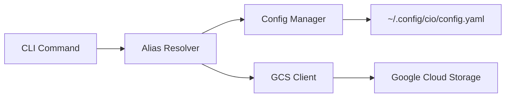

# cio - Cloud IO

A fast CLI tool for Google Cloud Storage and BigQuery that replaces common `gcloud storage` and `bq` commands with short aliases. Also provides a FUSE filesystem for browsing Google Cloud resources.

## Features

- **Alias Mappings**: Map short aliases to full GCS bucket paths and BigQuery datasets
- **GCS Operations**: List, copy, remove files with familiar Unix-like commands
- **BigQuery Support**: List datasets, tables, view schemas, and manage BigQuery resources
- **FUSE Filesystem**: Mount GCS buckets and BigQuery datasets as local filesystems
- **Wildcard Support**: Use `*.log`, `events_*` patterns for bulk operations
- **Fast**: Built in Go with metadata caching for speed and efficiency
- **Simple Configuration**: YAML-based configuration with environment variable support
- **ADC Authentication**: Uses Google Application Default Credentials

## Installation

### Download Pre-built Binaries

Download the latest release for your platform from the [Releases page](https://github.com/thieso2/cio/releases).

**Linux (amd64):**
```bash
wget https://github.com/thieso2/cio/releases/download/v1.0.0/cio_1.0.0_Linux_x86_64.tar.gz
tar -xzf cio_1.0.0_Linux_x86_64.tar.gz
sudo mv cio /usr/local/bin/
```

**macOS (Apple Silicon):**
```bash
wget https://github.com/thieso2/cio/releases/download/v1.0.0/cio_1.0.0_Darwin_arm64.tar.gz
tar -xzf cio_1.0.0_Darwin_arm64.tar.gz
sudo mv cio /usr/local/bin/
```

**macOS (Intel):**
```bash
wget https://github.com/thieso2/cio/releases/download/v1.0.0/cio_1.0.0_Darwin_x86_64.tar.gz
tar -xzf cio_1.0.0_Darwin_x86_64.tar.gz
sudo mv cio /usr/local/bin/
```

### Using Go Install

```bash
go install github.com/thieso2/cio/cmd/cio@latest
```

### From Source

```bash
git clone https://github.com/thieso2/cio.git
cd cio
mise build   # or: make build
mise install # or: make install
```

## Quick Start

### 1. Check Version

```bash
cio version
```

### 2. Authenticate with GCP

```bash
gcloud auth application-default login
# or: mise auth-setup
```

### 3. Create Your First Mappings

```bash
# GCS bucket mapping
cio map am gs://io-spooler-onprem-archived-metrics/

# BigQuery dataset mapping
cio map mydata bq://my-project-id.my-dataset
```

### 4. List Resources

**Google Cloud Storage:**
```bash
# Short format
cio ls :am

# Long format with details
cio ls -l :am

# Sort by size (largest first)
cio ls -lS :am

# Sort by time (newest first)
cio ls -lt :am

# Long format with human-readable sizes
cio ls -l --human-readable :am

# Recursive listing
cio ls -lr --human-readable :am/2024/

# Wildcard patterns
cio ls ':am/logs/*.log'
```

**BigQuery:**
```bash
# List tables
cio ls :mydata

# List with details (size, row counts)
cio ls -l :mydata

# Show table schema
cio info :mydata.events

# List with wildcards
cio ls ':mydata.events_*'
```

### 5. Copy and Remove Files

```bash
# Copy to GCS
cio cp file.txt :am/2024/

# Copy from GCS
cio cp :am/2024/data.csv ./

# Remove with confirmation
cio rm :am/temp/old-file.txt

# Remove with wildcards (shows preview first)
cio rm ':am/logs/*.tmp'

# Force remove without confirmation
cio rm -f :am/old-data/
```

## Configuration

Configuration is stored in YAML format at:
- `~/.config/cio/config.yaml` (primary)
- `~/.cio/config.yaml` (fallback)

You can also specify a config file with the `--config` flag or set the `CIO_CONFIG` environment variable.

### Example Configuration

```yaml
mappings:
  am: gs://io-spooler-onprem-archived-metrics/
  logs: gs://my-project-logs/
  data: gs://my-data-bucket/raw/

defaults:
  region: europe-west3
  project_id: ${PROJECT_ID}

server:
  port: 8080
  host: localhost
  auto_start: false
```

See [examples/config.example.yaml](examples/config.example.yaml) for a complete example.

## Commands

### Mapping Management

#### Create or Update a Mapping

```bash
cio map <alias> <gs-path>

# Examples
cio map am gs://io-spooler-onprem-archived-metrics/
cio map logs gs://my-project-logs/
cio map data gs://my-data-bucket/raw/
```

#### List All Mappings

```bash
cio map list
```

#### Show Full Path for an Alias

```bash
cio map show am
# Output: gs://io-spooler-onprem-archived-metrics/
```

#### Delete a Mapping

```bash
cio map delete am
```

### Listing Objects

#### Basic Listing

```bash
# List using alias
cio ls am

# List with nested path
cio ls am/2024/01/

# List using full GCS path
cio ls gs://my-bucket/path/
```

#### Long Format

```bash
# Show timestamp, size, and path
cio ls -l am

# Output example:
# 2024-01-15T10:30:00Z  1234567         gs://bucket/file.txt
# 2024-01-16T14:22:10Z  8901234         gs://bucket/data.csv
```

#### Human-Readable Sizes

```bash
cio ls -l --human-readable am

# Output example:
# 2024-01-15T10:30:00Z  1.2 MB          gs://bucket/file.txt
# 2024-01-16T14:22:10Z  8.5 MB          gs://bucket/data.csv
```

#### Recursive Listing

```bash
# List all objects recursively
cio ls -r am/2024/

# List recursively with details and human-readable sizes
cio ls -lr --human-readable am/2024/
```

#### Limit Results

```bash
# Show only first 100 results
cio ls --max-results 100 am
```

## Global Flags

- `--config <path>` - Specify config file location
- `--project <id>` - Override GCP project ID
- `--region <region>` - Override GCP region
- `-v, --verbose` - Enable verbose output

## Migration from gcloud

### Before (gcloud)

```bash
gcloud storage ls gs://io-spooler-onprem-archived-metrics/
gcloud storage ls -l gs://io-spooler-onprem-archived-metrics/2024/
gcloud storage ls -L gs://io-spooler-onprem-archived-metrics/
```

### After (cio)

```bash
# One-time setup
cio map am gs://io-spooler-onprem-archived-metrics/

# Then use short commands
cio ls am
cio ls -l am/2024/
cio ls -r am
```

## Architecture



## Authentication

cio uses Google Application Default Credentials (ADC) for authentication. The credentials are resolved in the following order:

1. `GOOGLE_APPLICATION_CREDENTIALS` environment variable pointing to a service account key file
2. User credentials from `gcloud auth application-default login`
3. Service account credentials (when running on GCE, Cloud Run, etc.)

### Setting Up Authentication

```bash
# For local development (recommended)
gcloud auth application-default login

# Or using a service account
export GOOGLE_APPLICATION_CREDENTIALS="/path/to/service-account.json"
```

## Development

### Prerequisites

- Go 1.25 or later
- Google Cloud SDK (for authentication)
- Access to GCS buckets

### Build

```bash
make build
```

### Install Locally

```bash
make install
```

### Run Tests

```bash
make test
```

### Clean Build Artifacts

```bash
make clean
```

### Using Mise (Recommended)

[Mise](https://mise.jdx.dev/) is a modern task runner that provides a better development experience. If you have mise installed, you can use it instead of make:

```bash
# Setup development environment
mise setup

# Build the project
mise build

# Run tests
mise test

# Run all checks (format, vet, test)
mise check

# View all available tasks
mise tasks

# Check development environment
mise doctor

# Install to $GOPATH/bin
mise install

# Build optimized release binaries
mise release-build

# Build for all platforms
mise release-build-all
```

Common mise tasks:
- `mise build` - Build the cio binary
- `mise test` - Run all tests
- `mise test-coverage` - Generate coverage report
- `mise fmt` - Format code
- `mise vet` - Run go vet
- `mise lint` - Run golangci-lint
- `mise check` - Run all checks
- `mise tidy` - Tidy dependencies
- `mise clean` - Remove build artifacts
- `mise stats` - Show project statistics
- `mise doctor` - Check development environment

See `.mise.toml` for the complete list of available tasks.

## Project Structure

```
cio/
├── cmd/cio/              # Main entry point
├── internal/
│   ├── cli/              # CLI commands (root, map, ls)
│   ├── config/           # Configuration management
│   ├── resolver/         # Alias resolution logic
│   ├── storage/          # GCS client and operations
│   └── server/           # Web server (Phase 4)
├── examples/             # Example configurations
├── go.mod                # Go module definition
├── Makefile              # Build automation
└── README.md             # This file
```

## Security

- Service account JSON files are excluded from git (see `.gitignore`)
- Web server binds to localhost by default for security
- All user input is validated to prevent path traversal attacks
- Uses Google's official Cloud Storage SDK for secure API access

## Roadmap

### ✅ Phase 1-5: Completed
- CLI foundation with Cobra
- Configuration management (YAML with env var expansion)
- Alias mapping system for GCS and BigQuery
- `ls` command with formatting options and sorting (`-S`, `-t`)
- BigQuery support (list datasets/tables, show schemas, wildcards)
- `cp` command (local ↔ GCS, recursive, wildcards)
- `rm` command (GCS and BigQuery, recursive, wildcards, confirmations)
- `info` command (detailed BigQuery table schemas)
- FUSE filesystem for GCS and BigQuery
- Metadata caching for performance

### 🚧 Phase 6: Future Enhancements
- BigQuery data operations (query, export, import)
- `mv` command for moving files
- `cat` command for displaying file contents
- `du` command for disk usage statistics
- Web server for file browsing
- Enhanced FUSE features (write support)
- Cloud SQL support

## Contributing

Contributions are welcome! Please feel free to submit issues and pull requests.

## License

MIT License - see LICENSE file for details

## Acknowledgments

- Built with [Cobra](https://github.com/spf13/cobra) for CLI framework
- Uses [Google Cloud Storage Go SDK](https://cloud.google.com/go/docs/reference/cloud.google.com/go/storage/latest)
