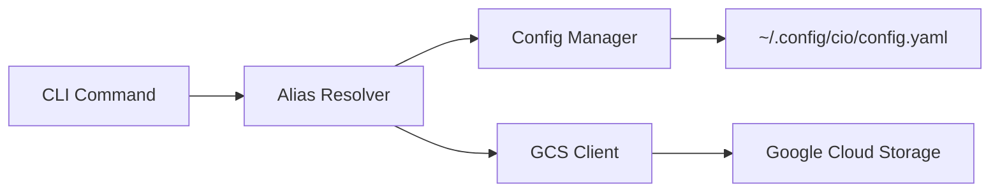

# cio - Cloud IO

A fast CLI tool for Google Cloud Storage and BigQuery that replaces common `gcloud storage` and `bq` commands with short aliases. Also provides an **experimental** FUSE filesystem for browsing Google Cloud resources (⚠️ alpha quality, AI-generated).

**Can also be used as a Go library** - see [LIBRARY.md](LIBRARY.md) for details.

## Features

- **Alias Mappings**: Map short aliases to full GCS bucket paths and BigQuery datasets
- **GCS Operations**: List, copy, remove files with familiar Unix-like commands
- **BigQuery Support**: List datasets, tables, view schemas, and manage BigQuery resources
- **IAM Support**: List and view IAM service accounts
- **🧪 FUSE Filesystem** ⚠️ **EXPERIMENTAL & 100% AI-GENERATED**: Mount GCS buckets, BigQuery datasets, and IAM service accounts as local filesystems (alpha quality, use with caution)
- **Wildcard Support**: Use `*.log`, `events_*` patterns for bulk operations
- **Fast**: Built in Go with metadata caching for speed and efficiency
- **Simple Configuration**: YAML-based configuration with environment variable support
- **ADC Authentication**: Uses Google Application Default Credentials
- **Go Library**: Use cio as a library in your Go projects for programmatic GCP access

## Installation

### As a CLI Tool

### Download Pre-built Binaries

Download the latest release for your platform from the [Releases page](https://github.com/thieso2/cio/releases).

**Linux (amd64):**
```bash
wget https://github.com/thieso2/cio/releases/download/v1.0.0/cio_1.0.0_Linux_x86_64.tar.gz
tar -xzf cio_1.0.0_Linux_x86_64.tar.gz
sudo mv cio /usr/local/bin/
```

**macOS (Apple Silicon):**
```bash
wget https://github.com/thieso2/cio/releases/download/v1.0.0/cio_1.0.0_Darwin_arm64.tar.gz
tar -xzf cio_1.0.0_Darwin_arm64.tar.gz
sudo mv cio /usr/local/bin/
```

**macOS (Intel):**
```bash
wget https://github.com/thieso2/cio/releases/download/v1.0.0/cio_1.0.0_Darwin_x86_64.tar.gz
tar -xzf cio_1.0.0_Darwin_x86_64.tar.gz
sudo mv cio /usr/local/bin/
```

### Using Go Install

```bash
go install github.com/thieso2/cio/cmd/cio@latest
```

### From Source

```bash
git clone https://github.com/thieso2/cio.git
cd cio
mise build   # or: make build
mise install # or: make install
```

### As a Go Library

```bash
go get github.com/thieso2/cio
```

See [LIBRARY.md](LIBRARY.md) for complete library documentation and examples.

**Quick Example:**
```go
package main

import (
	"context"
	"fmt"
	"log"

	"github.com/thieso2/cio/client"
)

func main() {
	c, err := client.New()
	if err != nil {
		log.Fatal(err)
	}
	defer c.Close()

	// List GCS objects
	objects, err := c.Storage().List(context.Background(), "gs://bucket/prefix/")
	if err != nil {
		log.Fatal(err)
	}

	for _, obj := range objects {
		fmt.Printf("%s (%d bytes)\n", obj.Name, obj.Size)
	}
}
```

## Quick Start (CLI)

### 1. Check Version

```bash
cio version
```

### 2. Authenticate with GCP

```bash
gcloud auth application-default login
# or: mise auth-setup
```

### 3. Create Your First Mappings

```bash
# GCS bucket mapping
cio map am gs://io-spooler-onprem-archived-metrics/

# BigQuery dataset mapping
cio map mydata bq://my-project-id.my-dataset
```

### 4. List Resources

**Google Cloud Storage:**
```bash
# Short format
cio ls :am

# Long format with details
cio ls -l :am

# Sort by size (largest first)
cio ls -lS :am

# Sort by time (newest first)
cio ls -lt :am

# Long format with human-readable sizes
cio ls -l --human-readable :am

# Recursive listing
cio ls -lr --human-readable :am/2024/

# Wildcard patterns
cio ls ':am/logs/*.log'
```

**BigQuery:**
```bash
# List tables
cio ls :mydata

# List with details (size, row counts)
cio ls -l :mydata

# Show table schema
cio info :mydata.events

# List with wildcards
cio ls ':mydata.events_*'
```

### 5. Copy and Remove Files

```bash
# Copy to GCS
cio cp file.txt :am/2024/

# Copy from GCS
cio cp :am/2024/data.csv ./

# Remove with confirmation
cio rm :am/temp/old-file.txt

# Remove with wildcards (shows preview first)
cio rm ':am/logs/*.tmp'

# Force remove without confirmation
cio rm -f :am/old-data/
```

## 🧪 EXPERIMENTAL: FUSE Filesystem

> **⚠️ WARNING: EXPERIMENTAL FEATURE**
>
> The FUSE filesystem functionality is **HIGHLY EXPERIMENTAL** and should be considered **ALPHA QUALITY** at best.
>
> **🤖 THIS CODE IS 100% AI-GENERATED** and has not been extensively tested in production environments.
>
> - **Use at your own risk** - may contain bugs, memory leaks, or unexpected behavior
> - **Not recommended for production use**
> - **Data loss is possible** - always have backups
> - **Performance may vary** - caching behavior is experimental
> - **API may change** without notice in future versions
>
> If you encounter issues, please report them on GitHub, but understand that support is limited.

The FUSE filesystem allows you to mount Google Cloud Storage buckets, BigQuery datasets, and IAM service accounts as local filesystems, enabling you to browse and interact with cloud resources using standard filesystem tools (`ls`, `cat`, `grep`, etc.).

### Prerequisites

**macOS:**
```bash
# Install macFUSE
brew install --cask macfuse
```

**Linux:**
```bash
# Install FUSE3
sudo apt-get install fuse3  # Debian/Ubuntu
sudo yum install fuse3      # RHEL/CentOS
```

### Basic Usage

```bash
# Mount all configured aliases to a directory
cio mount ~/gcs

# Mount with verbose logging
cio mount --verbose ~/gcs

# Mount with GCS API call logging
cio mount --log-gc ~/gcs

# Unmount (macOS)
umount ~/gcs

# Unmount (Linux)
fusermount -u ~/gcs
```

### Filesystem Structure

Once mounted, you'll see service directories:

```
~/gcs/
├── storage/         # GCS buckets
│   └── my-bucket/
│       ├── .meta/   # Metadata directory
│       ├── 2024/
│       └── data.csv
├── bigquery/        # BigQuery datasets
│   └── my-dataset/
│       ├── .meta/   # Metadata directory
│       ├── table1/
│       │   ├── schema.json
│       │   └── metadata.json
│       └── table2/
│           ├── schema.json
│           └── metadata.json
└── iam/             # IAM resources
    └── service-accounts/
        ├── account1@project.iam.gserviceaccount.com/
        │   └── metadata.json
        └── account2@project.iam.gserviceaccount.com/
            └── metadata.json
```

### Features

**GCS Support:**
- ✅ Read-only access to GCS objects
- ✅ List directories and files
- ✅ Read file contents
- ✅ Metadata files (`.meta/bucket_metadata.json`)
- ✅ Async read-ahead buffering for better performance
- ✅ Configurable metadata caching (default: 30 minutes)

**BigQuery Support:**
- ✅ Browse datasets and tables as directories
- ✅ View table schemas (`schema.json`)
- ✅ View table metadata (`metadata.json`)
- ✅ Metadata caching for performance

**IAM Support:**
- ✅ Browse service accounts as directories
- ✅ View service account metadata (`metadata.json`)
- ✅ Metadata caching for performance

### Metadata Files

Special `.meta/` directories contain metadata about the resources:

**GCS Buckets:**
```bash
cat ~/gcs/am/.meta/bucket_metadata.json
```

**BigQuery Tables:**
```bash
cat ~/gcs/bigquery/my-dataset/table1/schema.json
cat ~/gcs/bigquery/my-dataset/table1/metadata.json
```

**IAM Service Accounts:**
```bash
cat ~/gcs/iam/service-accounts/my-sa@project.iam.gserviceaccount.com/metadata.json
```

### Advanced Options

```bash
# Clear metadata cache on mount
cio mount --clean-cache ~/gcs

# Enable detailed GCS/BigQuery API logging
cio mount --log-gc ~/gcs

# Combine options
cio mount --verbose --log-gc --clean-cache ~/gcs
```

### Performance Considerations

- **Metadata caching**: Lists of objects/tables are cached for 30 minutes
- **Read-ahead buffering**: GCS file reads use async prefetching
- **Lazy loading**: Resources are only fetched when accessed
- **Cache location**: `~/.cache/cio/metadata/`

### Use Cases

```bash
# Browse GCS buckets with standard tools
ls -lh ~/gcs/am/2024/
find ~/gcs/am -name "*.log"
grep "error" ~/gcs/am/logs/app.log

# Explore BigQuery schemas
cat ~/gcs/mydata/events/schema.json | jq '.fields[]'

# Copy files from GCS
cp ~/gcs/am/2024/data.csv ~/local/

# Process GCS files with standard tools
wc -l ~/gcs/am/logs/*.log
tail -f ~/gcs/am/logs/latest.log
```

### Known Limitations

- **Read-only**: Write operations are not supported
- **Performance**: Network latency affects filesystem operations
- **Caching**: Stale data possible with aggressive caching
- **Large files**: May be slow without optimization
- **Wildcards**: Some shell wildcards may not work as expected
- **Symbolic links**: Not supported
- **File permissions**: All files appear as read-only
- **Timestamps**: May not reflect actual cloud timestamps accurately

### Troubleshooting

**Mount fails:**
```bash
# Check if macFUSE/FUSE3 is installed
which macfuse  # macOS
which fusermount3  # Linux

# Check if mount point exists and is empty
ls -la ~/gcs

# Try with verbose logging
cio mount --verbose ~/gcs
```

**Filesystem appears empty:**
```bash
# Check your mappings
cio map list

# Verify GCP authentication
gcloud auth application-default print-access-token
```

**Performance issues:**
```bash
# Clear metadata cache
rm -rf ~/.cache/cio/metadata/

# Mount with cache cleaning
cio mount --clean-cache ~/gcs
```

**Unmount issues:**
```bash
# Force unmount (macOS)
sudo umount -f ~/gcs

# Force unmount (Linux)
sudo fusermount -uz ~/gcs
```

For more details, see [FUSE.md](FUSE.md).

## Configuration

Configuration is stored in YAML format at:
- `~/.config/cio/config.yaml` (primary)
- `~/.cio/config.yaml` (fallback)

You can also specify a config file with the `--config` flag or set the `CIO_CONFIG` environment variable.

### Example Configuration

```yaml
mappings:
  am: gs://io-spooler-onprem-archived-metrics/
  logs: gs://my-project-logs/
  data: gs://my-data-bucket/raw/

defaults:
  region: europe-west3
  project_id: ${PROJECT_ID}
  parallelism: 50  # Number of concurrent operations for cp/rm (1-200)

server:
  port: 8080
  host: localhost
  auto_start: false
```

See [examples/config.example.yaml](examples/config.example.yaml) for a complete example.

### Parallelism Configuration

The number of concurrent operations for `cp` (copy) and `rm` (remove) commands can be configured in three ways (listed in priority order):

1. **Command-line flag**: `--parallel` or `-j`
   ```bash
   cio cp -j 100 -r ./large-dir/ :am/backup/
   cio rm -j 75 ':am/temp/*'
   ```

2. **Environment variable**: `CIO_PARALLEL`
   ```bash
   export CIO_PARALLEL=100
   cio cp -r ./large-dir/ :am/backup/
   ```

3. **Config file**: `defaults.parallelism` field
   ```yaml
   defaults:
     parallelism: 100
   ```

**Default value**: 50 concurrent operations
**Valid range**: 1-200

Higher parallelism speeds up operations on large numbers of files but uses more network connections and memory. Lower values reduce resource usage but may be slower.

## Commands

### Mapping Management

#### Create or Update a Mapping

```bash
cio map <alias> <gs-path>

# Examples
cio map am gs://io-spooler-onprem-archived-metrics/
cio map logs gs://my-project-logs/
cio map data gs://my-data-bucket/raw/
```

#### List All Mappings

```bash
cio map list
```

#### Show Full Path for an Alias

```bash
cio map show am
# Output: gs://io-spooler-onprem-archived-metrics/
```

#### Delete a Mapping

```bash
cio map delete am
```

### IAM Service Accounts

List IAM service accounts in a project.

```bash
# List service accounts (short format - email only)
cio ls iam://my-project-id/service-accounts

# List with details (email, display name, disabled status)
cio ls -l iam://my-project-id/service-accounts
```

**Output format:**
- **Short**: Service account email only
- **Long**: Email, Display Name, Disabled status in columnar format

**Example output (long format):**
```
EMAIL                                                        DISPLAY_NAME                   DISABLED
my-sa@project.iam.gserviceaccount.com                       My Service Account             False
another-sa@project.iam.gserviceaccount.com                  Another Service Account        True
```

Similar to `gcloud iam service-accounts list`.

### Authentication

#### Print Access Token

Print an OAuth 2.0 access token for authenticating with Google Cloud APIs.

```bash
# Using Application Default Credentials (ADC)
cio auth print-access-token

# Using service account JSON file
cio auth print-access-token -c /path/to/service-account.json

# Use in curl command
curl -H "Authorization: Bearer $(cio auth print-access-token)" \
  https://storage.googleapis.com/storage/v1/b
```

**Flags:**
- `-c, --credentials` - Path to service account JSON file

Similar to `gcloud auth print-access-token`.

#### Print Identity Token

Print an OpenID Connect (OIDC) identity token for authenticating with services that require identity tokens (e.g., Cloud Run, Cloud Functions).

```bash
# Using user credentials with service account impersonation (recommended)
cio auth print-identity-token \
  -a https://my-service-abc123.run.app \
  --impersonate-service-account=my-sa@project.iam.gserviceaccount.com

# Using service account JSON file
cio auth print-identity-token \
  -a https://my-service.run.app \
  -c /path/to/service-account.json

# Use in curl command to call Cloud Run
curl -H "Authorization: Bearer $(cio auth print-identity-token -a https://my-service.run.app --impersonate-service-account=my-sa@project.iam.gserviceaccount.com)" \
  https://my-service-abc123.run.app
```

**Flags:**
- `-a, --audience` - Target audience URL (required)
- `--impersonate-service-account` - Service account to impersonate (for user credentials)
- `-c, --credentials` - Path to service account JSON file

**Note:** User credentials from `gcloud auth application-default login` cannot generate identity tokens directly. You must either:
- Use service account impersonation (requires `roles/iam.serviceAccountTokenCreator` role)
- Use a service account JSON file with `-c`

Similar to `gcloud auth print-identity-token --impersonate-service-account`.

### Listing Objects

#### Basic Listing

```bash
# List using alias
cio ls am

# List with nested path
cio ls am/2024/01/

# List using full GCS path
cio ls gs://my-bucket/path/
```

#### Long Format

```bash
# Show timestamp, size, and path
cio ls -l am

# Output example:
# 2024-01-15T10:30:00Z  1234567         gs://bucket/file.txt
# 2024-01-16T14:22:10Z  8901234         gs://bucket/data.csv
```

#### Human-Readable Sizes

```bash
cio ls -l --human-readable am

# Output example:
# 2024-01-15T10:30:00Z  1.2 MB          gs://bucket/file.txt
# 2024-01-16T14:22:10Z  8.5 MB          gs://bucket/data.csv
```

#### Recursive Listing

```bash
# List all objects recursively
cio ls -r am/2024/

# List recursively with details and human-readable sizes
cio ls -lr --human-readable am/2024/
```

#### Limit Results

```bash
# Show only first 100 results
cio ls --max-results 100 am
```

## Global Flags

- `--config <path>` - Specify config file location
- `--project <id>` - Override GCP project ID
- `--region <region>` - Override GCP region
- `-v, --verbose` - Enable verbose output

## Migration from gcloud

### Storage Commands

**Before (gcloud):**
```bash
gcloud storage ls gs://io-spooler-onprem-archived-metrics/
gcloud storage ls -l gs://io-spooler-onprem-archived-metrics/2024/
gcloud storage ls -L gs://io-spooler-onprem-archived-metrics/
```

**After (cio):**
```bash
# One-time setup
cio map am gs://io-spooler-onprem-archived-metrics/

# Then use short commands
cio ls am
cio ls -l am/2024/
cio ls -r am
```

### Authentication Commands

**Before (gcloud):**
```bash
gcloud auth print-access-token
gcloud auth print-identity-token --audiences=https://my-service.run.app
gcloud auth print-identity-token --impersonate-service-account=my-sa@project.iam.gserviceaccount.com --audiences=https://my-service.run.app
```

**After (cio):**
```bash
cio auth print-access-token
cio auth print-identity-token -a https://my-service.run.app \
  --impersonate-service-account=my-sa@project.iam.gserviceaccount.com
```

## Architecture



## Authentication

cio uses Google Application Default Credentials (ADC) for authentication. The credentials are resolved in the following order:

1. `GOOGLE_APPLICATION_CREDENTIALS` environment variable pointing to a service account key file
2. User credentials from `gcloud auth application-default login`
3. Service account credentials (when running on GCE, Cloud Run, etc.)

### Setting Up Authentication

```bash
# For local development (recommended)
gcloud auth application-default login

# Or using a service account
export GOOGLE_APPLICATION_CREDENTIALS="/path/to/service-account.json"
```

## Development

### Prerequisites

- Go 1.25 or later
- Google Cloud SDK (for authentication)
- Access to GCS buckets

### Build

```bash
make build
```

### Install Locally

```bash
make install
```

### Run Tests

```bash
make test
```

### Clean Build Artifacts

```bash
make clean
```

### Using Mise (Recommended)

[Mise](https://mise.jdx.dev/) is a modern task runner that provides a better development experience. If you have mise installed, you can use it instead of make:

```bash
# Setup development environment
mise setup

# Build the project
mise build

# Run tests
mise test

# Run all checks (format, vet, test)
mise check

# View all available tasks
mise tasks

# Check development environment
mise doctor

# Install to $GOPATH/bin
mise install

# Build optimized release binaries
mise release-build

# Build for all platforms
mise release-build-all
```

Common mise tasks:
- `mise build` - Build the cio binary
- `mise test` - Run all tests
- `mise test-coverage` - Generate coverage report
- `mise fmt` - Format code
- `mise vet` - Run go vet
- `mise lint` - Run golangci-lint
- `mise check` - Run all checks
- `mise tidy` - Tidy dependencies
- `mise clean` - Remove build artifacts
- `mise stats` - Show project statistics
- `mise doctor` - Check development environment

See `.mise.toml` for the complete list of available tasks.

## Project Structure

```
cio/
├── cmd/cio/              # Main entry point
├── internal/
│   ├── cli/              # CLI commands (root, map, ls)
│   ├── config/           # Configuration management
│   ├── resolver/         # Alias resolution logic
│   ├── storage/          # GCS client and operations
│   └── server/           # Web server (Phase 4)
├── examples/             # Example configurations
├── go.mod                # Go module definition
├── Makefile              # Build automation
└── README.md             # This file
```

## Security

- Service account JSON files are excluded from git (see `.gitignore`)
- Web server binds to localhost by default for security
- All user input is validated to prevent path traversal attacks
- Uses Google's official Cloud Storage SDK for secure API access

## Roadmap

### ✅ Phase 1-5: Completed (Stable)
- CLI foundation with Cobra
- Configuration management (YAML with env var expansion)
- Alias mapping system for GCS and BigQuery
- `ls` command with formatting options and sorting (`-S`, `-t`)
- BigQuery support (list datasets/tables, show schemas, wildcards)
- `cp` command (local ↔ GCS, recursive, wildcards)
- `rm` command (GCS and BigQuery, recursive, wildcards, confirmations)
- `info` command (detailed BigQuery table schemas)
- Metadata caching for performance

### 🧪 Experimental (Alpha Quality)
- **FUSE filesystem for GCS and BigQuery** ⚠️ **100% AI-GENERATED CODE**
  - Read-only access to GCS objects and BigQuery metadata
  - Mount cloud resources as local directories
  - Metadata caching and async read-ahead
  - Known issues: performance, caching edge cases, stability
  - **Not production-ready** - use at your own risk

### 🚧 Phase 6: Future Enhancements
- BigQuery data operations (query, export, import)
- `mv` command for moving files
- `cat` command for displaying file contents
- `du` command for disk usage statistics
- Web server for file browsing
- Enhanced FUSE features (write support, better performance)
- Cloud SQL support

## Contributing

Contributions are welcome! Please feel free to submit issues and pull requests.

## License

MIT License - see LICENSE file for details

## Acknowledgments

- Built with [Cobra](https://github.com/spf13/cobra) for CLI framework
- Uses [Google Cloud Storage Go SDK](https://cloud.google.com/go/docs/reference/cloud.google.com/go/storage/latest)
- Uses [Google Cloud BigQuery Go SDK](https://cloud.google.com/go/docs/reference/cloud.google.com/go/bigquery/latest)
- FUSE filesystem powered by [go-fuse](https://github.com/hanwen/go-fuse) ⚠️ **Experimental implementation is 100% AI-generated**
