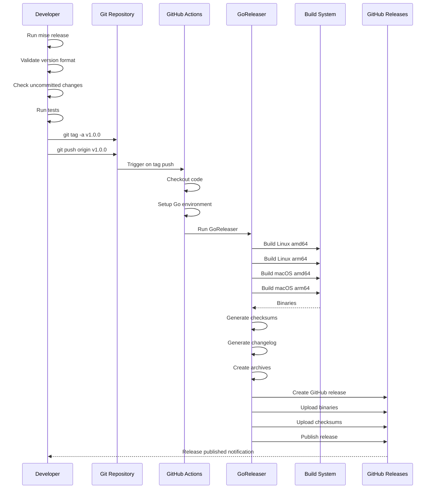
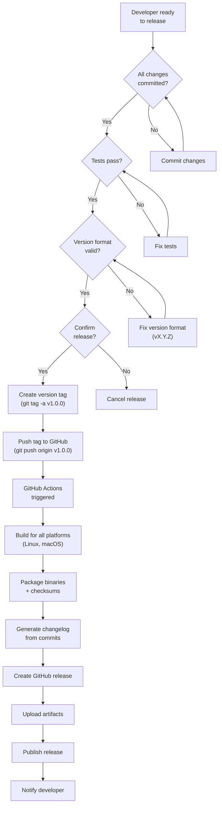

# Release Process

This document describes how to create a new release of `cio`.

## Overview

The project uses [GoReleaser](https://goreleaser.com/) for automated builds and releases. When you push a version tag, GitHub Actions automatically:

1. Builds binaries for multiple platforms (Linux, macOS)
2. Creates a GitHub release with changelog
3. Uploads all binaries and checksums

### Automated Release Workflow



### Release Process Flow



## Supported Platforms

- **Linux**: amd64, arm64
- **macOS**: amd64 (Intel), arm64 (Apple Silicon)

## Creating a Release

### Method 1: Using Mise (Recommended)

The easiest way to create a release is using the mise task:

```bash
# Create and push a new release
mise release -- v1.0.0
```

This task will:
1. ✅ Validate the version format
2. ✅ Check for uncommitted changes
3. ✅ Run all tests
4. ✅ Show what will be tagged
5. ✅ Ask for confirmation
6. ✅ Create and push the tag

We follow [Semantic Versioning](https://semver.org/):
- `v1.0.0` - Major version (breaking changes)
- `v1.1.0` - Minor version (new features, backwards compatible)
- `v1.0.1` - Patch version (bug fixes)
- `v1.0.0-beta.1` - Pre-release versions

### Method 2: Manual Release

If you prefer to create the release manually:

```bash
# 1. Ensure everything is ready
git checkout main
git pull origin main
mise test
mise build

# 2. Create and push a version tag
git tag -a v1.0.0 -m "Release v1.0.0"
git push origin v1.0.0
```

### 2. Monitor the Release

1. Go to the [Actions tab](https://github.com/thieso2/cio/actions) in GitHub
2. Watch the "Release" workflow
3. Once complete, check the [Releases page](https://github.com/thieso2/cio/releases)

### 3. Verify the Release

The release should include:
- Binaries for all supported platforms
- SHA256 checksums (`checksums.txt`)
- Automatically generated changelog
- Source code archives

## Useful Mise Tasks

```bash
# Preview changes since last release
mise release-changelog

# Test release process locally (creates binaries in dist/)
mise release-test

# Validate GoReleaser configuration
mise release-check

# Install GoReleaser (macOS only)
mise release-install-goreleaser

# View all release-related tasks
mise tasks | grep release
```

## Local Testing with GoReleaser

You can test the release process locally without publishing:

```bash
# Install GoReleaser (if not already installed)
brew install goreleaser  # macOS
# or
go install github.com/goreleaser/goreleaser/v2@latest

# Test the release configuration (snapshot mode, no publishing)
goreleaser release --snapshot --clean

# Binaries will be in the dist/ directory
ls -lh dist/
```

## Version Information

The build process embeds version information into the binary using ldflags:

- **version**: The git tag (e.g., `v1.0.0`)
- **commit**: The git commit hash
- **date**: Build timestamp
- **builtBy**: Set to `goreleaser` for releases

You can check the version:

```bash
cio version
```

Example output:
```
cio version v1.0.0
  commit: abc123def
  built:  2024-01-19T10:30:00Z
  by:     goreleaser
```

## Manual Release (Advanced)

If you need to create a release manually:

```bash
# Set environment variables
export GITHUB_TOKEN="your-github-token"

# Run GoReleaser
goreleaser release --clean
```

## Troubleshooting

### Release Workflow Fails

1. Check the [Actions logs](https://github.com/thieso2/cio/actions)
2. Common issues:
   - Go version mismatch: Update `.github/workflows/release.yml`
   - GoReleaser config error: Validate with `goreleaser check`
   - Missing permissions: Check `GITHUB_TOKEN` permissions

### Tag Already Exists

If you need to re-create a tag:

```bash
# Delete local tag
git tag -d v1.0.0

# Delete remote tag
git push origin :refs/tags/v1.0.0

# Create and push new tag
git tag -a v1.0.0 -m "Release v1.0.0"
git push origin v1.0.0
```

## Changelog

The changelog is automatically generated from commit messages. Use conventional commits for better changelog organization:

- `feat:` - New features
- `fix:` - Bug fixes
- `refactor:` - Code refactoring
- `perf:` - Performance improvements
- `docs:` - Documentation changes
- `test:` - Test changes
- `chore:` - Maintenance tasks

Example:
```bash
git commit -m "feat: add BigQuery table wildcards support"
git commit -m "fix: handle empty dataset names correctly"
git commit -m "refactor: simplify metadata caching logic"
```

## Pre-release Versions

To create a pre-release (beta, alpha, rc):

```bash
# Create pre-release tag
git tag -a v1.0.0-beta.1 -m "Release v1.0.0-beta.1"
git push origin v1.0.0-beta.1
```

GoReleaser will automatically mark it as a pre-release on GitHub.

## Next Steps

After a successful release:

1. Announce the release (if applicable)
2. Update documentation if needed
3. Close related issues/milestones on GitHub
4. Update any dependent projects
